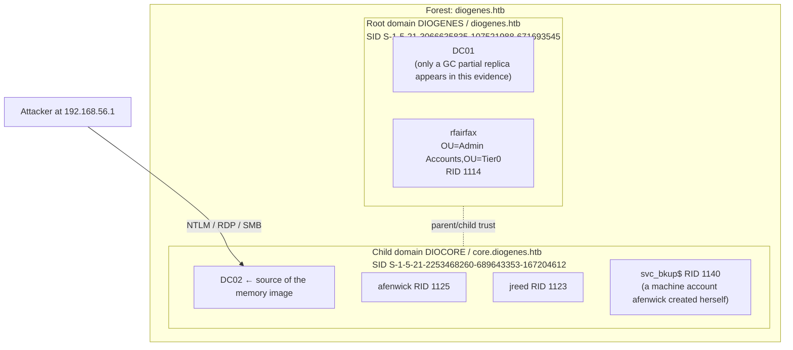
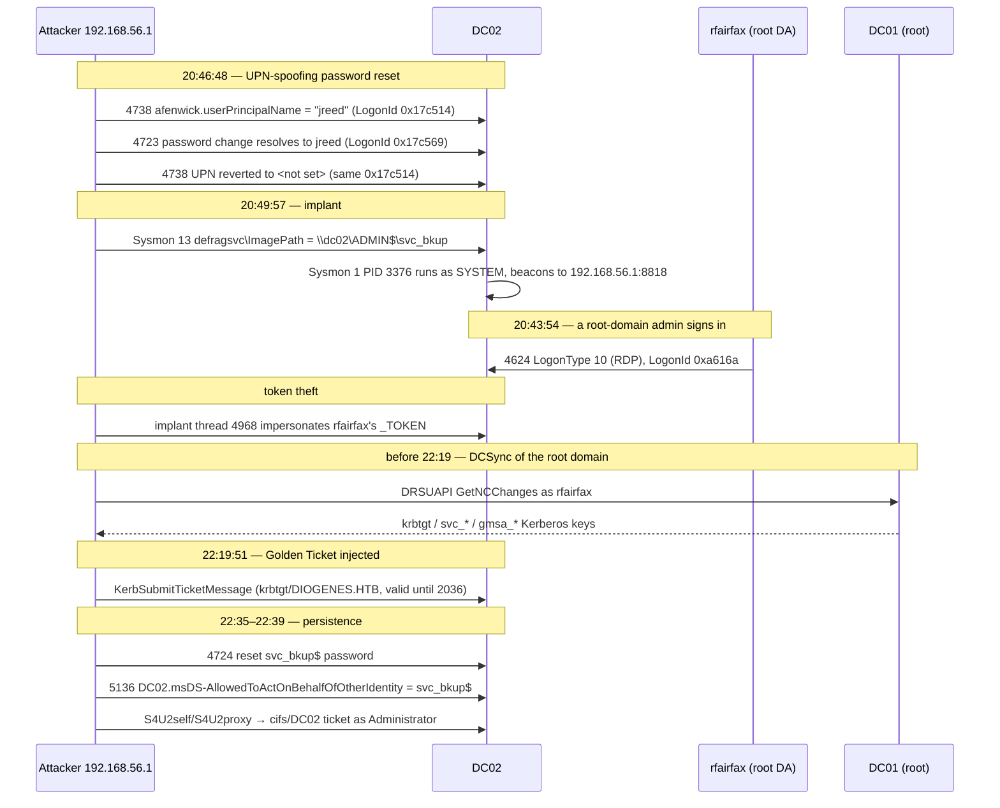
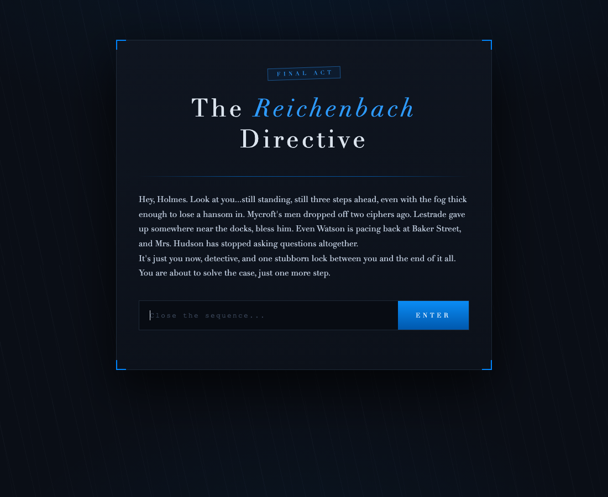
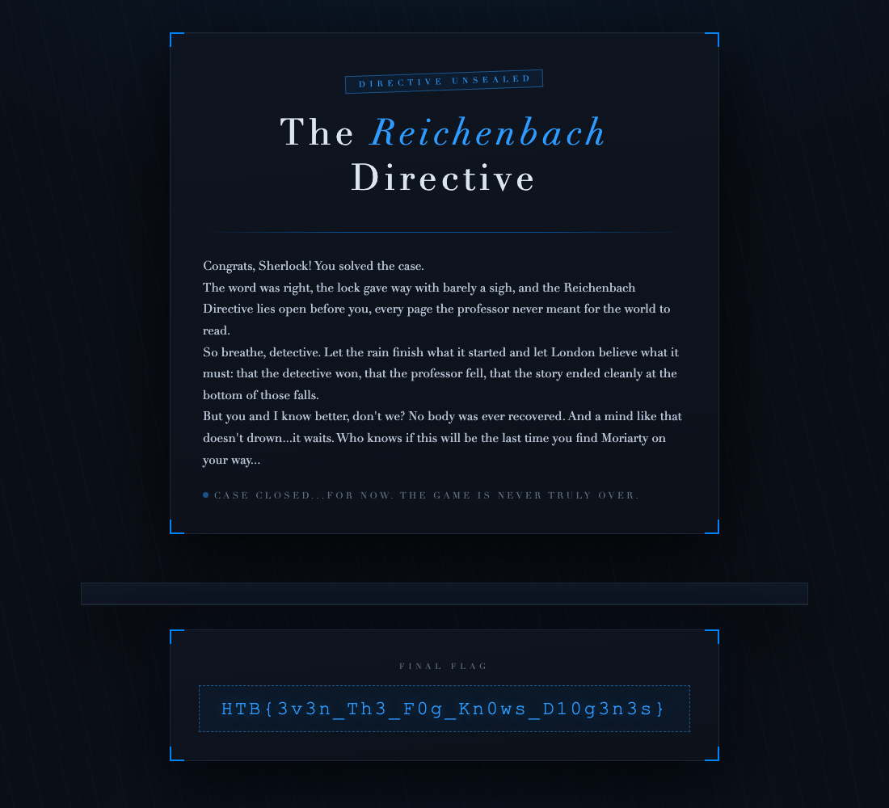

# Holmes CTF 2026 — Sherlock 09 "LastLight / DIOGENES" Writeup

## 1. TL;DR

A 3.2 GB memory image of a domain controller, its event logs and an NTDS backup are enough to
rebuild an entire Active Directory intrusion: a UPN-spoofing password reset, a PsExec-style service
implant, the theft of a forest-root admin's access token, a DCSync, a forged Golden Ticket, and an
RBCD backdoor planted on the DC itself. The final flag is unlocked by handing the challenge portal
the two logon sessions behind the password attack.

Final flag: `HTB{3v3n_Th3_F0g_Kn0ws_D10g3n3s}`

### 1.1 Questions & Answers Summary

| Question | Description | Submission Format | Accepted Answer |
|---|---|---|---|
| **Q1** | SHA256 of the defragsvc service agent implant | SHA256 (uppercase) | `1E44C63950DD4FE1FFCC955C08D509132BCADDF87BBB08F5EA622D0533625274` |
| **Q2** | Address and ccache MD5 of the Golden Ticket with Extra SID | `0xaddress:md5sum` | `0x227473721b0:dcf56965eee82fff4d381c6127834d72` |
| **Q3** | KDCChecksum signature hash from the same ticket | MD5 (lowercase) | `b63742148ab83e91d38dd632b5b1fb99` |
| **Q4** | Kernel address of the stolen Tier0 admin `_TOKEN` | `0xaddress` (48-bit truncated) | `0xca8ddc130830` |
| **Q5** | ImpersonationLevel and LogonId of the stolen token | `level:0xLogonId` | `2:0xa616a` |
| **Q6** | Thread ID (TID) executing the impersonation | TID | `4968` |
| **Q7** | Target principal and SID granted RBCD rights | `sAMAccountName:SID` | `svc_bkup$:S-1-5-21-2253468260-689643353-167204612-1140` |
| **Q8** | Forest root domain (DIOGENES) SID | SID | `S-1-5-21-3066635835-107521988-671693545` |
| **Q9** | SubjectLogonId and LogonType used to write RBCD | `0xLogonId:LogonType` | `0x3f213b:3` |
| **Q10** | Prepare and reset LogonIds of the UPN password attack | `0xprepare:0xreset` | `0x17c514:0x17c569` |
| **Final** | Final Reichenbach Directive flag from challenge gate | `HTB{...}` | `HTB{3v3n_Th3_F0g_Kn0ws_D10g3n3s}` |

---

## 2. Environment Setup

### 2.1 What you get

```
LastLight/
├── memory.elf                                   # 3.2 GB ELF64 core dump of DC02
├── C/Windows/System32/winevt/logs/
│   ├── Security.evtx                            # 31,730 records
│   └── Microsoft-Windows-Sysmon%4Operational.evtx   # 18,709 records
└── ntdsutil/
    ├── Active Directory/ntds.dit                # DC02's directory database (IFM copy)
    └── registry/{SYSTEM, SECURITY}              # supplies the bootkey that decrypts it
```

### 2.2 Toolchain

There is no native Windows-memory tooling on macOS, so build an isolated environment first. Nothing
here is platform-specific — the same commands work on Linux.

```bash
python3.13 -m venv .venv-forensics
./.venv-forensics/bin/pip install volatility3 impacket dissect.esedb dissect.eventlog python-evtx pycryptodome
```

Volatility reads the ELF64 core directly through its `Elf64Layer`; no conversion step is needed.

```bash
./.venv-forensics/bin/vol -q -f memory.elf windows.info
```

```
Major/Minor     15.17763            # Windows Server 2019
NtProductType   NtProductLanManNt   # domain controller
SystemTime      2026-09-09 22:40:38 UTC
```

That timestamp is worth pausing on. The RBCD backdoor was written at 22:38:41, which puts the
acquisition **117 seconds** after the last hostile action. Everything — impersonation tokens,
Kerberos tickets, DCSync debris — is still resident.

### 2.3 The environment being investigated



---

## 3. Reconstructing the Intrusion



---

## 4. What the Attacker Walked Away With

| Asset | Where the evidence lives |
|---|---|
| Control of `jreed`'s password | Security 4723 |
| SYSTEM execution on DC02 | the `svc_bkup` service implant |
| `DIOGENES\rfairfax`'s access token (root Tier0 admin) | a stolen `_TOKEN` in kernel memory |
| Root-domain `krbtgt` and every Tier0 service key | DCSync debris in the implant's heap |
| A permanent impersonation channel into DC02 | RBCD pointing at `svc_bkup$` |

---

## 5. Analysis Method

Each step below maps to the correspondingly numbered step in [`solve.py`](solve.py).

### Step 1 — Normalise the event logs

`dissect.eventlog` is pure Python and handles 30 MB of records in seconds. Converting both logs to
JSONL once turns every later question into a one-line query.

```bash
./.venv-forensics/bin/python - <<'PY'
from dissect.eventlog.evtx import Evtx
import json, datetime
def d(o):
    return o.isoformat() if isinstance(o,(datetime.datetime,datetime.date)) else (o.hex() if isinstance(o,bytes) else str(o))
for src,dst in [("C/Windows/System32/winevt/logs/Security.evtx","notes/security.jsonl"),
                ("C/Windows/System32/winevt/logs/Microsoft-Windows-Sysmon%4Operational.evtx","notes/sysmon.jsonl")]:
    with open(src,"rb") as fh, open(dst,"w") as out:
        for rec in Evtx(fh): out.write(json.dumps(dict(rec), default=d)+"\n")
PY
```

---

### Step 2 — Q1: SHA256 of the service agent

Start with the process tree, because a hostile service binary rarely blends in:

```bash
./.venv-forensics/bin/vol -q -f memory.elf windows.pstree
```

```
** 3376  596  svc_bkup  0xda87568d5080  4  0  False  2026-09-09 20:49:57
       \Device\Mup\dc02\ADMIN$\svc_bkup
```

The parent is `services.exe` (PID 596) and the image path is a **UNC path** rather than a file on
`C:`. That is the signature of the PsExec / Impacket `psexec.py` family: drop the payload on
`ADMIN$` and point a service straight at the share.

Sysmon caught both halves of the install:

```bash
grep svc_bkup notes/sysmon.jsonl | ./.venv-forensics/bin/python -c "
import sys,json
for l in sys.stdin:
    d=json.loads(l)
    if d['EventID'] in (1,13): print(d['EventID'], d['UtcTime'], d.get('TargetObject') or d.get('Image'), d.get('Details') or d.get('Hashes'))
"
```

```
13  2026-09-09 20:49:57.390  HKLM\System\CurrentControlSet\Services\defragsvc\ImagePath  \\dc02\ADMIN$\svc_bkup
1   2026-09-09 20:49:57.400  \\dc02\ADMIN$\svc_bkup
    MD5=AE74305B36C450B8850E34599426D28A,
    SHA256=1E44C63950DD4FE1FFCC955C08D509132BCADDF87BBB08F5EA622D0533625274,
    IMPHASH=74F4CAFB93287C883ECA7117A3FA3FD0
```

Note what was hijacked: `defragsvc`, an **existing** service. Because no service was created, there
is no Security 4697 anywhere in the log — the registry write in Sysmon 13 is the only trace.

**Q1 — `1E44C63950DD4FE1FFCC955C08D509132BCADDF87BBB08F5EA622D0533625274`**

The implant is a beacon, not a one-shot tool:

```bash
./.venv-forensics/bin/vol -q -f memory.elf windows.netscan | grep 3376
```

```
TCPv4  192.168.56.11:54162 -> 192.168.56.1:8818  ESTABLISHED  3376  svc_bkup
```

---

### Step 3 — Recover every key from NTDS

```bash
./.venv-forensics/bin/python .venv-forensics/bin/secretsdump.py \
  -ntds "ntdsutil/Active Directory/ntds.dit" \
  -system ntdsutil/registry/SYSTEM \
  -security ntdsutil/registry/SECURITY \
  LOCAL -outputfile notes/secrets
```

Twenty-five accounts come back, and the important one is the child domain's `krbtgt`:

```
krbtgt:502:aad3b435b51404eeaad3b435b51404ee:e812d14a9c390f7400549593fc98a2c2:::
krbtgt:aes256-cts-hmac-sha1-96:925fb2153387e8ed7c96251f77ef73f348b2320f3175307f6aa56fcb7a385423
```

Everything here belongs to **CORE** (including the child domain `krbtgt` RC4 and AES keys). The attacker
specifically leveraged this child domain `krbtgt` key to forge the Golden Ticket carrying the forest root Enterprise Admins
Extra SID (the core of Q2 and Q3). Additionally, resident in the implant agent's memory (PID 3376) are remnants of
a DRSUAPI DCSync pulled from DC01 (detailed in Section 7.7).

---

### Step 4 — Q7: who the RBCD backdoor trusts

Security 5136 records the write, but Windows could not render the value:

```
AttributeLDAPDisplayName: msDS-AllowedToActOnBehalfOfOtherIdentity
AttributeValue:           Malformed Security Descriptor
```

So the SID has to come out of NTDS. The attribute's OID is `1.2.840.113556.1.4.2182`, and NTDS
column names follow `ATT<type><589824 + OID tail>`:

```
589824 + 2182 = 592006  →  column ATTp592006
```

The `p` prefix means "security-descriptor reference": the stored value is an index into `sd_table`,
not the descriptor itself.

```bash
./.venv-forensics/bin/python - <<'PY'
from dissect.esedb import EseDB
db=EseDB(open('ntdsutil/Active Directory/ntds.dit','rb'))
dt, sdt = db.table('datatable'), db.table('sd_table')
ref = next(r.get('ATTp592006') for r in dt.records() if r.get('ATTm590045')=='DC02$')
sd_id = int.from_bytes(ref[:8],'little')
val = next(r.get('sd_value') for r in sdt.records() if r.get('sd_id')==sd_id)
print('sd_id', sd_id, val.hex())
PY
```

```
sd_id 251
010004804000000000000000000000001400000004002c000100000000002400ff010f00
01050000000000051500000064325186591f1b290457f7097404000001020000000000052000000020020000
```

Unpacking that self-relative `SECURITY_DESCRIPTOR` by hand:

| Bytes | Meaning |
|---|---|
| `01 00 04 80` | Revision 1, control `0x8004` (self-relative, DACL present) |
| `40000000` | DACL at offset 0x40 |
| `04 00 2c 00 01000000` | ACL rev 4, size 0x2c, **one ACE** |
| `00 00 24 00` | ACE type 0 (ACCESS_ALLOWED), size 0x24 |
| `ff 01 0f 00` | access mask `0x000f01ff` = GENERIC_ALL |
| `0105…7404 0000` | `S-1-5-21-2253468260-689643353-167204612-1140` |

RID 1140 resolves against NTDS's `sAMAccountName` column to **`svc_bkup$`**.

**Q7 — `svc_bkup$:S-1-5-21-2253468260-689643353-167204612-1140`**

Two independent corroborations:

- `svc_bkup$`'s `mS-DS-CreatorSID` (`ATTr591234`) is RID 1125 — **afenwick**. She created the
  machine account herself, which the default MachineAccountQuota of 10 permits.
- A 4724 at 22:35:44 resets `svc_bkup$`'s password, three minutes before the RBCD write. RBCD is
  only useful if you know the delegated account's credentials, so the ordering makes sense.

---

### Step 5 — Q8: the forest root SID

Sweep every `objectSid` in NTDS and count the `S-1-5-21-a-b-c` prefixes:

```
S-1-5-21-2253468260-689643353-167204612   58 objects   ← DIOCORE (child)
S-1-5-21-3066635835-107521988-671693545   53 objects   ← DIOGENES (root)
```

Two independent signals identify the root:

1. Tombstoned objects in NTDS still carry the CNs `S-1-5-21-3066635835-107521988-671693545-519`
   and `-518`. **RID 519 (Enterprise Admins) and 518 (Schema Admins) exist only in the forest root.**
2. `DC01$` (`dc01.diogenes.htb`) carries that prefix.

**Q8 — `S-1-5-21-3066635835-107521988-671693545`**

> A classic NTDS trap sits here: **objectSid is stored with its final sub-authority (the RID) in
> big-endian**. Decode the whole SID little-endian and `DC02$` comes out as RID `3909287936`
> instead of `1001`. The tell is that the first three sub-authorities match the event logs
> perfectly and only the last one is nonsense.

---

### Step 6 — Q9: the session that planted the backdoor

Of the eleven 5136 events, exactly one touches an attribute other than `servicePrincipalName`:

```bash
./.venv-forensics/bin/python - <<'PY'
import json
for l in open('notes/security.jsonl'):
    d=json.loads(l)
    if d.get('EventID')==5136 and 'AllowedToAct' in str(d.get('AttributeLDAPDisplayName')):
        for k in ('TimeCreated_SystemTime','ObjectDN','SubjectUserName','SubjectLogonId','AttributeValue'):
            print(f"  {k}: {d[k]}")
PY
```

```
  TimeCreated_SystemTime: 2026-09-09 22:38:41.642750+00:00
  ObjectDN:               CN=DC02,OU=Domain Controllers,DC=core,DC=diogenes,DC=htb
  SubjectUserName:        jreed
  SubjectLogonId:         0x3f213b
  AttributeValue:         Malformed Security Descriptor
```

Pivot on the LogonId to find how that session was established:

```
4624  2026-09-09 22:38:38  TargetUserName=jreed  TargetLogonId=0x3f213b
      LogonType=3  AuthenticationPackageName=NTLM  IpAddress=192.168.56.1
```

Logon type 3 is a network logon — NTLM-authenticated LDAP straight from the attacker's host. It
also closes the loop with Step 10: `jreed` is the account whose password was stolen at 20:46.

**Q9 — `0x3f213b:3`**

---

### Step 7 — Q2: carving the injected Golden Ticket

The question says "**without dumping LSASS**", which points to avoiding process memory extraction (such as `windows.memmap --dump`, pypykatz, or procdump) and instead using a dedicated Volatility 3 plugin designed to parse Windows Kerberos Security Support Provider (SSP) structures directly: [Airbus CERT `volatility-kerberos`](https://github.com/airbus-cert/volatility-kerberos).

This plugin walks the doubly-linked lists of Kerberos sessions and cached tickets maintained in `lsass.exe`'s LSA memory space without needing to dump the process:

```bash
git clone https://github.com/airbus-cert/volatility-kerberos
./.venv-forensics/bin/vol -p ./volatility-kerberos -s ./volatility-kerberos \
    -f memory.elf kerberos.Tickets
```

The output reveals the forged ticket in the cache:

```text
Address        Client                             Server                                          Encryption Type  Start Time                 End Time
0x227473721b0  Administrator @ CORE.DIOGENES.HTB  krbtgt/CORE.DIOGENES.HTB @ CORE.DIOGENES.HTB    RC4_HMAC         2026-09-09 22:17:41+00:00  2036-09-06 22:17:41+00:00
```

- **Memory Address**: `0x227473721b0`
- **Lifetime**: 10 years (`2026-09-09` to `2036-09-06`), characteristic of a Golden Ticket
- **Encryption**: `RC4_HMAC` (while legitimate tickets across the domain use AES256)

Dump the ticket into Kirbi format using `kerberos.Dump`:

```bash
./.venv-forensics/bin/vol -f memory.elf -p ./volatility-kerberos -s ./volatility-kerberos \
    kerberos.Dump --address 0x227473721b0 --output ./out/
```

This writes `./out/0x227473721b0.kirbi`.

The question specifically requests the **md5sum in `ccache` format**. Using the standard Impacket utility `ticketConverter.py`:

```bash
./.venv-forensics/bin/python .venv-forensics/bin/ticketConverter.py \
    ./out/0x227473721b0.kirbi ./out/0x227473721b0.ccache
md5 -q ./out/0x227473721b0.ccache      # md5sum on Linux
```

```text
dcf56965eee82fff4d381c6127834d72
```

Formatting as `(0xaddress:md5sum)`:

**Q2 — `0x227473721b0:dcf56965eee82fff4d381c6127834d72`**

---

### Step 8 — Q3: PAC signatures and ExtraSids

The prompt asks: *"From the same ticket, provide the KDCChecksum Signature hash"*, referencing the ticket that *"contains the extra SID"*.

In an Active Directory forest, an attacker with child domain control can forge a Golden Ticket using the child domain's `krbtgt` key and inject the forest root domain's **Enterprise Admins SID (`RID 519`)** into the PAC's `ExtraSids` field, escalating privileges from the child domain to the entire forest root.

Step 3 extracted the child domain's `krbtgt` RC4 key from `ntds.dit`:
```text
krbtgt:502:aad3b435b51404eeaad3b435b51404ee:e812d14a9c390f7400549593fc98a2c2:::
```

Using `impacket-describeTicket` to parse and decrypt the PAC of `0x227473721b0.ccache`:

```bash
./.venv-forensics/bin/python .venv-forensics/bin/describeTicket.py \
    ./out/0x227473721b0.ccache --rc4 e812d14a9c390f7400549593fc98a2c2
```

The decrypted PAC data confirms the attack anatomy:

```text
[*] Ticket Session Key            : dcbdf2e6c20bde38aca1305c89bb7aab
[*] User Name                     : Administrator
[*] User Realm                    : CORE.DIOGENES.HTB
[*] Service Name                  : krbtgt/CORE.DIOGENES.HTB
[*] Logged Domain SID             : S-1-5-21-2253468260-689643353-167204612 (DIOCORE)
[*] Extra SID Count               : 1
[*] Extra SIDs                    : S-1-5-21-3066635835-107521988-671693545-519 Enterprise Admins
[*] ServerChecksum                : 5cc2da157cb1c50b8f555401bea362af
[*] KDCChecksum                   : b63742148ab83e91d38dd632b5b1fb99
```

- **Extra SID**: `S-1-5-21-3066635835-107521988-671693545-519` (Enterprise Admins of the root domain).
- **KDCChecksum** (`PAC_PRIVSVR_CHECKSUM`): HMAC-MD5 signature computed over the PAC with the child domain `krbtgt` key.

**Q3 — `b63742148ab83e91d38dd632b5b1fb99`**

Those last two are the payoff of the RBCD backdoor: a `cifs/DC02` ticket issued as `Administrator`
at 22:39:43, fifty-five seconds before acquisition.

---

### Step 9 — Q4 / Q5 / Q6: the stolen token

Token theft is invisible to the event log. `DuplicateTokenEx` followed by
`ImpersonateLoggedOnUser` produces no Security event at all, so the only evidence is in kernel
objects.

```mermaid
graph LR
    EP["_EPROCESS<br/>(process)"] -->|Token (_EX_FAST_REF)| PT["_TOKEN<br/>primary<br/>TokenType=1"]
    EP -->|ThreadListHead| ET["_ETHREAD<br/>(thread)"]
    ET -->|ClientSecurity<br/>_PS_CLIENT_SECURITY_CONTEXT| IT["_TOKEN<br/>impersonation<br/>TokenType=2"]
    IT --> AID["AuthenticationId (LUID)<br/>= LogonId in the event log"]
    IT --> IL["ImpersonationLevel<br/>0 anon / 1 identify / 2 impersonate / 3 delegate"]
```

`_PS_CLIENT_SECURITY_CONTEXT.ImpersonationData` is a `ULONG_PTR` whose **low three bits are flags**
(two for the level, one for `EffectiveOnly`); mask them off with `& ~0x7` to get the real `_TOKEN`
pointer.

The detection rule: a process whose **primary** token is SYSTEM (`AuthenticationId = 0x3e7`) but
which has a thread impersonating a **domain user's** logon session.

Of 193 threads holding an impersonation token, exactly one matches:

```
PID 3376  svc_bkup  TID=4968  impTOKEN=0xffffca8ddc130830
          tokType=Impersonation  tokImpLvl=2  AuthId=0xa616a
          SID=S-1-5-21-3066635835-107521988-671693545-1114
```

Cross-referencing the LogonId in Security.evtx:

```
4624  2026-09-09 20:43:54  TargetUserName=rfairfax  TargetDomainName=DIOGENES
      TargetUserSid=S-1-5-21-3066635835-107521988-671693545-1114
      TargetLogonId=0xa616a  LogonType=10 (RemoteInteractive/RDP)  IpAddress=192.168.56.1
```

`rfairfax` is a **root-domain** Tier0 administrator. The moment they RDP'd into an already-owned
child-domain DC, their token became available to a SYSTEM process the attacker controlled. That is
the Tier0 boundary failing in a single step.

- **Q4 — `0xffffca8ddc130830`**
- **Q5 — `2:0xa616a`** (2 = `SecurityImpersonation`)
- **Q6 — `4968`**

Distinguishing theft from routine RPC matters here: `svchost`, `spoolsv` and `csrss` also
impersonate `0xa616a`, but those are user-initiated RPC calls with a legitimate relationship to the
session. `svc_bkup` is a C2 implant launched from a network share; it has no business holding a
domain administrator's token.

---

### Step 10 — Q10: the two logon sessions behind the password attack

Pull every 4723 / 4724 / 4738 from the day of the intrusion and sort by time:

```bash
./.venv-forensics/bin/python - <<'PY'
import json
rows=[json.loads(l) for l in open('notes/security.jsonl')]
rows=[d for d in rows if d.get('EventID') in (4723,4724,4738) and (d.get('TimeCreated_SystemTime') or '')>='2026-09-09']
for d in sorted(rows, key=lambda x: x['TimeCreated_SystemTime']):
    print(d['TimeCreated_SystemTime'], d['EventID'], 'tgt=%s'%d.get('TargetUserName'),
          'subj=%s'%d.get('SubjectUserName'), 'logon=%s'%d.get('SubjectLogonId'),
          'UPN=%s'%d.get('UserPrincipalName'))
PY
```

```
20:46:48.072  4738  tgt=afenwick  subj=afenwick  logon=0x17c514  UPN=jreed      ← prepare
20:46:48.111  4738  tgt=afenwick  subj=afenwick  logon=0x17c514  UPN=%%1793     ← revert (<not set>)
20:46:48.137  4738  tgt=jreed     subj=ANONYMOUS LOGON  logon=0x3e6  PasswordLastSet=…
20:46:48.137  4723  tgt=jreed     subj=afenwick  logon=0x17c569                 ← reset
22:35:44.674  4724  tgt=svc_bkup$ subj=afenwick  logon=0x3e2bd5
```

Read in order, this is a **UPN-spoofing password reset**:

1. `afenwick` sets **her own** `userPrincipalName` to `jreed` (4738, LogonId `0x17c514`).
2. She calls "change password" (SAMR `ChangePasswordUser`). The server resolves the principal by
   UPN and lands on **`jreed`** — hence 4723's `TargetUserName` (LogonId `0x17c569`).
3. The UPN is immediately reverted to unset, erasing the tell (same session `0x17c514`).

The question asks for the two subject logon IDs that are neither the account owner nor the
administrator, one preparing and one resetting. `0x3e6` is `ANONYMOUS LOGON` — the system-side
reflection of the password change, not an actor — and `0x3e2bd5` targets `svc_bkup$`, a different
account entirely. What remains is exactly afenwick's two sessions.

**Q10 — `0x17c514:0x17c569`**

---

## 6. Unlocking the Flag

The portal at `http://154.57.164.65:31580/` is a single password gate. Its `app.js` POSTs the input
to `/unlock` and, on success, fetches `/dossier`.



**Raw HTTP (paste straight into Burp Repeater):**

```http
POST /unlock HTTP/1.1
Host: 154.57.164.65:31580
Content-Type: application/json
Content-Length: 39

{"password":"0x17c514:0x17c569"}
```

**Equivalent curl:**

```bash
curl -s -i -c /tmp/ck.txt -X POST http://154.57.164.65:31580/unlock \
     -H 'Content-Type: application/json' \
     -d '{"password":"0x17c514:0x17c569"}'
```

```http
HTTP/1.1 200 OK
Set-Cookie: finalact_session=abce6267…; Path=/; Max-Age=3600; HttpOnly; SameSite=Strict

{"status":"unsealed"}
```

Then retrieve the dossier with that session cookie:

```http
GET /dossier HTTP/1.1
Host: 154.57.164.65:31580
Accept: text/fragment
Cookie: finalact_session=abce6267…
```

```bash
curl -s -b /tmp/ck.txt -H 'Accept: text/fragment' http://154.57.164.65:31580/dossier
```



```
HTB{3v3n_Th3_F0g_Kn0ws_D10g3n3s}
```

The comparison is case-sensitive: `0x17C514:0x17C569` returns `401 {"error":"Wrong sequence"}`.

---

## 7. Pitfalls

### 7.1 Carving tickets out of physical memory gives you broken DER

The first pass ran the KRB-CRED regex directly over `memory.elf`. All six blobs matched, but five
failed to parse (`BER length field size 34 exceeds limit`). A 1.3 KB ticket crosses a 4 KB page
boundary, and virtually contiguous pages are not physically contiguous. **Anything larger than a
page must be carved in virtual address space** — that is what `windows.memmap --dump` is for.

### 7.2 NTDS stores the RID big-endian

Decoding `objectSid` uniformly little-endian gave `DC02$` a RID of `3909287936`. `0xE9030000`
byte-reversed is `0x3E9` = 1001, which matches the SID in event 4624.

### 7.3 Event 5136 will not give you the RBCD SID

Windows writes the literal string `Malformed Security Descriptor` for
`msDS-AllowedToActOnBehalfOfOtherIdentity`. Do not try to parse it — it really is that string. The
SID only exists in NTDS's `sd_table`.

### 7.4 `ATTr591978` is not the RBCD column

Misremembering the OID as `1.4.2154` produces column `ATTr591978`, which is empty on `DC02$` — long
enough to suggest the NTDS snapshot predated the attack. The correct OID is
**`1.2.840.113556.1.4.2182`** → `ATTp592006`, and the `p` prefix means the value is an `sd_table`
index rather than the descriptor. The robust habit is to **dump every non-null column of the target
object** rather than deriving a column name from memory.

### 7.5 Copy impacket's NDR sequence for `KERB_VALIDATION_INFO` verbatim

Hand-rolled padding arithmetic produced garbage (`SidCount=5439575`). The working sequence is the
one in `describeTicket.py`:

```python
type1 = TypeSerialization1(data)
newdata = data[len(type1) + 4:]
kerbdata = pac.KERB_VALIDATION_INFO()
kerbdata.fromString(newdata)
kerbdata.fromStringReferents(newdata[len(kerbdata.getData()):])
```

### 7.6 Defender's signature database poisons string searches

Grepping memory for `Rubeus`, `mimikatz`, `ticketer`, `golden` or `sidhistory` returns dozens of
hits — every one inside `MsMpEng.exe`'s VDM signature blobs, with `!#HSTR:Trojan:…` markers
alongside. Always read the surrounding bytes before treating a suspicious string as attacker
residue.

### 7.7 Deep forensics: recovering the root domain krbtgt key and the first Golden Ticket

During initial ticket carving in `lsass.exe` virtual space, a plaintext-injected (`cred-etype = 0`) root-domain Golden Ticket (`Administrator@DIOGENES.HTB`) was discovered at virtual address `0x22747394084`:

- The ticket targets `krbtgt/DIOGENES.HTB`, requiring the **root domain's** `krbtgt` key to decrypt its PAC.
- The supplied NTDS belongs to DC02 (child domain CORE) and lacks password hashes for the forest root.
- However, the attacker's service implant (PID 3376 `svc_bkup`) had executed a DRSUAPI DCSync against the root DC01, and its heap retained the DRSUAPI encrypted `unicodePwd` blobs!
- DRSUAPI attribute encryption operates as:
  1. Derives `finalMD5 = MD5(SessionKey || Salt)` using the 32-byte Kerberos session key and a 16-byte salt.
  2. Decrypts the 20-byte ciphertext using RC4 with `finalMD5`.
  3. The first 4 decrypted bytes must equal the IEEE 802.3 CRC32 of the subsequent 16 bytes.
  4. The 16 bytes are then DES-decrypted using keys derived from the user RID (krbtgt = 502) to reveal the NT hash!
- By implementing a high-throughput multi-threaded C scanner (`crack_krbtgt_session_key32.c`) using the CRC32 check as a $2^{-32}$ rejection filter, the 32-byte RPC session key was swept across PID 3376's memory.
- The scanner matched precisely at offset `0x194820`:
  - **DCSync 32-byte Session Key**: `d0f0ad009faf1d707a9a4d4741622b01772a91efaabdbb95b5ef580914da2786`
  - **Recovered Root Domain `krbtgt` NT Hash**: `fbea5f562336f67d174208e4b63be781`
- Decrypting this root Golden Ticket with `describeTicket.py`:
  - **ServerChecksum**: `9a082a3bb94d210600746848b224e3be`
  - **KDCChecksum**: `a54c1e4866190d479687bb7fdd9f836d`
  - **ExtraSids**: Count = 0 (natively a root-domain admin account, with RID 519 in its standard group memberships).

### 7.8 The Crucial Distinction: Two Golden Tickets and the meaning of "Without dumping LSASS"

This nuance is the core trap of the challenge — attacker Napoleon injected **two distinct Golden Tickets**:

1. **Root Domain Native Golden Ticket** (`0x22747394084`):
   Forged with the root `krbtgt` key from DCSync. It has KDCChecksum `a54c1e4866190d479687bb7fdd9f836d`, but has 0 ExtraSids.
2. **Child Domain Privilege Escalation Golden Ticket** (`0x227473721b0`):
   Forged using the child domain's own `krbtgt` key (`e812d14a9c390f7400549593fc98a2c2`) from DC02's `ntds.dit`, with the forest root **Enterprise Admins SID (`S-1-5-21-3066635835-107521988-671693545-519`)** injected into the PAC's `ExtraSids` to traverse the trust boundary upward. This is the exact ticket sought by the prompt (*"the ticket which contains the extra SID"*).
   - Its KDCChecksum is `b63742148ab83e91d38dd632b5b1fb99`.

Furthermore, the prompt hint "**Without dumping LSASS**" steered investigators directly to the open-source Volatility 3 extension [Airbus CERT `volatility-kerberos`](https://github.com/airbus-cert/volatility-kerberos). Rather than dumping process memory, this plugin traverses LSASS's internal Kerberos session and ticket tables in-place. Extracting `0x227473721b0.kirbi` and converting it with Impacket's `ticketConverter.py` yields the exact accepted ccache MD5: `dcf56965eee82fff4d381c6127834d72`.

---

## 8. Full Exploit

The complete, runnable analysis pipeline is [`solve.py`](solve.py). Its header comment
lists the same ten steps as Section 5, in the same order.

```bash
cd LastLight
source .venv-forensics/bin/activate
python3 solve.py
```

---

## 9. Lessons

1. **The acquisition window decides what you can see.** This image was taken 117 seconds after the
   last hostile action, so tokens, tickets and DCSync debris were all still resident. When memory is
   captured is itself a quality property of the evidence.

2. **Encryption type is the cheapest anomaly detector in Kerberos.** A modern AD forest is AES256
   end to end. A single RC4 ticket, or a single etype-0 KRB-CRED, is worth a closer look, and it
   costs one integer comparison rather than a behavioural timeline.

3. **Some attacks are simply absent from the event log.** Token theft generates no Security event,
   and Windows cannot even render the RBCD value it just wrote. Log-only detection cannot see
   either; memory or directory-database evidence is required.

4. **Hijacking a service is quieter than creating one.** Rewriting `defragsvc`'s `ImagePath`
   produces no 4697 — only Sysmon 13. Detection content should cover service *modification*, not
   just service creation.

5. **A child domain is not a security boundary.** SYSTEM on a child DC plus one root-domain admin
   logging in is a complete path to the forest root. Tier0 accounts authenticating to lower-trust
   machines hand their tokens to whoever already owns those machines.

6. **Forensic data-structure trivia is worth writing down.** The big-endian RID, `ATTp` as an
   `sd_table` index, and the three flag bits in `ImpersonationData` each cost real time to
   rediscover.

---

## 10. Glossary

| Term | Meaning |
|---|---|
| **TGT (Ticket Granting Ticket)** | The master Kerberos ticket, exchanged with the KDC for service tickets. Encrypted with the `krbtgt` account's key. |
| **Golden Ticket** | A TGT forged offline after stealing the `krbtgt` key. The KDC validates the signature rather than consulting the directory, so the forger picks the identity, group membership and lifetime. |
| **PAC (Privilege Attribute Certificate)** | Authorisation data inside the ticket's encrypted part: user RID, group list, ExtraSids, and two signatures. |
| **ExtraSids** | The PAC field carrying additional SIDs. Inserting the root domain's Enterprise Admins SID (`…-519`) is the standard child-to-parent escalation. |
| **KDCChecksum / PAC_PRIVSVR_CHECKSUM** | The PAC's second signature, computed with the **krbtgt key**. Unforgeable without it, which makes it the gate on any Golden Ticket question. |
| **ccache / kirbi** | Two container formats for tickets. `.kirbi` is the Windows/mimikatz KRB-CRED DER; `ccache` is the MIT Kerberos (and impacket) format. `ticketConverter.py` converts between them. |
| **RBCD (Resource-Based Constrained Delegation)** | Setting `msDS-AllowedToActOnBehalfOfOtherIdentity` on the **target** object to let a chosen account impersonate anyone to it. Written onto a DC's computer object, it is permanent backdoor access. |
| **S4U2self / S4U2proxy** | Kerberos extensions. S4U2self obtains a ticket to yourself on behalf of any user; S4U2proxy exchanges it for a ticket to another service. Together they are how RBCD is actually exercised. |
| **DCSync** | Impersonating a DC and calling DRSUAPI `GetNCChanges` to replicate password hashes out of the directory. Requires "Replicating Directory Changes All", which Domain Admins hold by default. |
| **`_TOKEN` / `_EPROCESS` / `_ETHREAD`** | Windows kernel objects for the access token, the process, and the thread respectively. |
| **ImpersonationLevel** | How far a borrowed token may be used: 0 anonymous, 1 identification, 2 impersonation (local), 3 delegation (across the network). |
| **LogonId / AuthenticationId (LUID)** | The unique id of a logon session. The event log calls it `LogonId`; the kernel's `_TOKEN` calls it `AuthenticationId`. They are the same value, and they are the bridge between logs and memory. |
| **UPN (userPrincipalName)** | A user's logon name in `user@domain` form. It is **not guaranteed unique**, which is what makes setting your own UPN to someone else's sAMAccountName a viable attack. |
| **NTDS.dit / IFM** | The Active Directory database (ESE format). `ntdsutil ifm` produces an offline copy bundling NTDS with the SYSTEM/SECURITY hives that supply the decryption bootkey. |
| **GC (Global Catalog)** | A forest-wide index holding a **partial** attribute set for every domain — notably excluding password attributes. |
| **MachineAccountQuota** | How many computer accounts an ordinary user may join to the domain (default 10). This is how `afenwick` was able to create `svc_bkup$`. |
