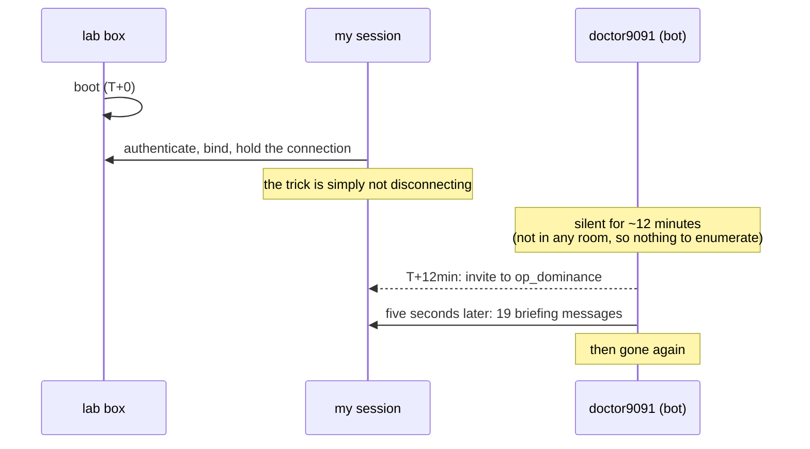
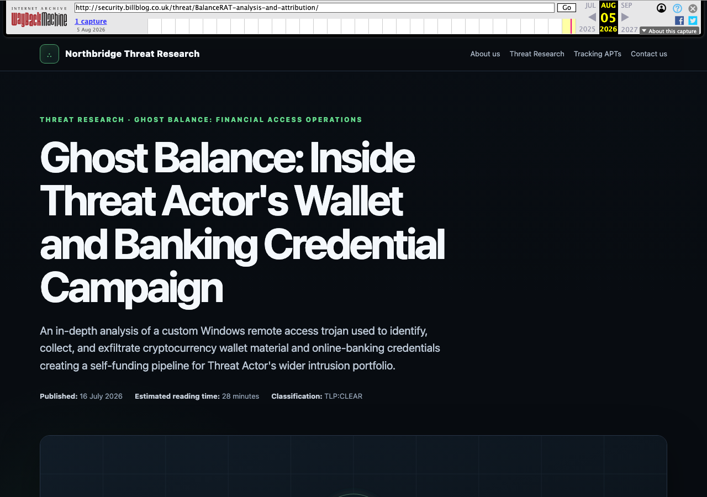
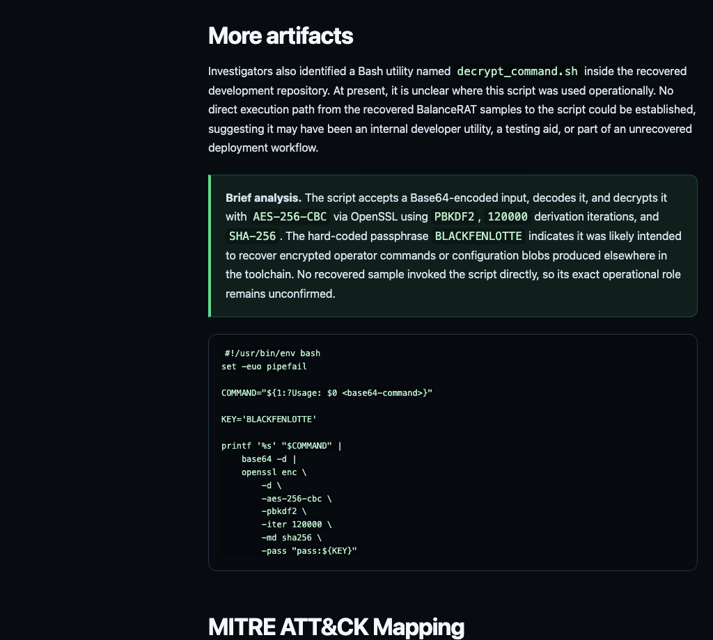
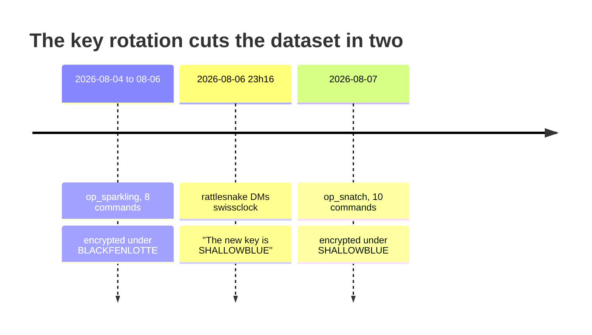
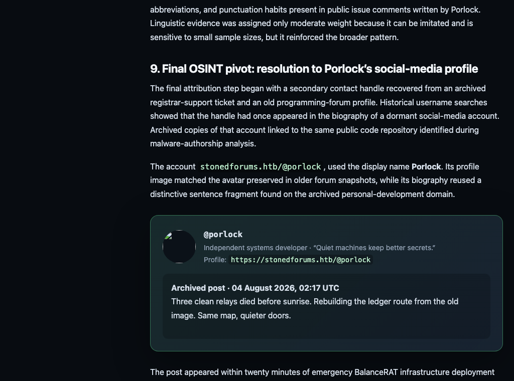

# Holmes CTF 2026 — Sherlock 03 "Whisper Chain" Writeup

> Category: Threat Intelligence / live-service reconnaissance (blue team)
> Target: a Prosody XMPP server (`murknet.htb`) reachable only through the lab VPN
> Result: 8/8

---

## 1. TL;DR

A TLS certificate hands over the whole XMPP estate; open in-band registration hands over an account; a public chat room hands over four rotated-but-not-really passwords and a joke about someone leaking their username through a PDF; the file share's PDF metadata names that someone; their bookmarks name two chat rooms service discovery refuses to list; sitting connected and doing nothing for twelve minutes earns an invite to a third; and the decryptor for the eighteen encrypted operator commands turns out to be published verbatim in a threat-intel article whose host is dead but whose Wayback capture is not — under **two** different keys, split across a key rotation.

---

## 2. Environment Setup

### 2.1 What ships with the challenge

`WhisperChain.zip` contains exactly one file — the story PDF. No disk image, no pcap, no evidence archive:

```bash
unzip -l WhisperChain.zip
# 1 file, 755773 bytes — "Holmes CTF 2026 - Sherlock 03 - XMPP Threat Intelligence"
```

The PDF has nothing hidden in it either (`embfile_count()=0`, no optional-content groups). Which tells you something useful straight away: **every answer lives on the remote host.** This is a live reconnaissance challenge wearing a forensics costume.

The `/Title` field — `XMPP Threat Intelligence` — is the first real clue, because it tells you what you're about to connect to.

### 2.2 Tooling

```bash
# ships with the OS
openssl s_client      # certificate retrieval
nmap                  # service fingerprinting
curl                  # file share and Wayback

# Python side
pip install pycryptodome pikepdf
```

Notably absent: an XMPP client library. I ended up hand-rolling XMPP over a raw socket, and section 6 explains why that wasn't stubbornness — on this particular network path, a library actively got in the way.

### 2.3 Ports

```bash
nmap -Pn -sV -p 22,443,5222,5223,5269,5280,5281 10.129.x.x
```

| Port | Service | Role in the solve |
|---|---|---|
| 22 | OpenSSH 9.6p1 | none |
| 443 | nginx 1.24.0 | **where the certificate comes from** (the page itself is a stub) |
| 5222 | XMPP c2s | the main event |
| 5269 | XMPP s2s | none |
| 5281 | Prosody HTTPS | file share, and also serves the certificate |

> **First trap.** Port 5222 is vhost-strict. Point a stream at the bare IP and Prosody answers `This server does not serve <IP>` — you never see a certificate. Grab it from **443 or 5281** instead.

### 2.4 Hosts file

Once you know the domains, map all four before going further; every later step depends on SNI and `to=` matching:

```
10.129.x.x  murknet.htb groups.murknet.htb command.murknet.htb upload.murknet.htb
```

---

## 3. Vulnerability Analysis: a chain made entirely of misconfiguration

There is no memory corruption here and no injection. Every weakness is an operational-discipline failure, and they're deliberately arranged so that each one is only reachable through the previous one:

```mermaid
flowchart TD
    A["TLS certificate SANs<br/>leak four vhosts"] --> B["XEP-0077 open registration<br/>anyone can mint an account"]
    B --> C["public room 'infra'<br/>rattlesnake pastes 4 temp passwords"]
    C --> D["'resources' room banter<br/>'imagine leaking your username via pdf'"]
    D --> E["file-share PDF metadata<br/>Author = zytglogge88@murknet.htb"]
    E --> F["password spray<br/>swissclock never rotated"]
    F --> G["XEP-0048 bookmarks<br/>name rooms disco won't list"]
    G --> H["stay idle<br/>a bot invites you to op_dominance"]
    F --> I["pubsub nodes<br/>18 AES-encrypted commands"]
    J["Wayback Machine<br/>the leaked decrypt_command.sh"] --> I
    I --> K["Flags 4 / 5 / 7"]

    style A fill:#1a3a2a
    style J fill:#3a2a1a
    style K fill:#3a1a1a
```



### 3.1 The certificate is a free asset inventory

To cover four subdomains with one self-signed certificate, the operator listed all of them in `subjectAltName`:

```
CN = murknet.htb
subjectAltName = DNS:murknet.htb, DNS:groups.murknet.htb,
                 DNS:command.murknet.htb, DNS:upload.murknet.htb
```

That single line tells you there is a group-chat service, something called `command`, and a file upload endpoint. Certificates are public by design — which means your internal service naming is too.

### 3.2 In-band registration is wide open

The post-TLS stream features advertise:

```xml
<register xmlns='http://jabber.org/features/iq-register'/>
```

Anyone can create an account. **This one setting is what makes the entire rest of the chain reachable.** Without it there is no way in at all.

A practical wrinkle: the box reaps self-registered accounts after roughly **ten minutes**. Register and work in the same session; don't register now and come back later.

### 3.3 Passwords pasted into a public room

`infra@groups.murknet.htb` is public — any registered account reads the full history. In it, `rattlesnake` posts four temporary passwords in plain text:

```
KillBill2025!   K4w4Bong424!   Northwind225!   TickTock24!
```

`doctor` orders an immediate rotation. `swissclock` says they'll get to it soon and is told `not "soon" / NOW!`.

That exchange is the challenge pointing at its own answer: the person who was publicly nagged about stalling is the one who never rotated.

### 3.4 A username leaked through document metadata

In the `resources` room:

```
"is the metadata clean on this?"
"imagine leaking your damn username through a pdf lol"
```

That's not flavour text, it's an instruction. Pull everything from `https://upload.murknet.htb:5281/file_share/` and read the Info dictionaries. `Operational_Onboarding_Guide_v3.2.pdf` gives up:

```
Author  : zytglogge88@murknet.htb
Creator : swissclock
```

The Zytglogge is the clock tower in Bern — `zytglogge88` is `swissclock`. The two identities line up, so the account in the metadata belongs to the operator who was told to rotate and didn't.

### 3.5 Bookmarks expose what service discovery hides

This is the single most transferable lesson in the challenge. Authenticated as swissclock, `disco#items` against `groups.murknet.htb` **still returns only the four public rooms.** The operational rooms are `muc_hidden`, so discovery genuinely does not know about them.

But the account's own bookmarks (XEP-0048, stored in XEP-0049 private storage) list them anyway:

```xml
<storage xmlns='storage:bookmarks'>
  <conference jid='op_snatch@groups.murknet.htb'    autojoin='true'/>
  <conference jid='op_sparkling@groups.murknet.htb' autojoin='true'/>
</storage>
```

Before I worked this out I brute-forced roughly seventy candidate room names against a calibrated oracle and hit nothing — because hidden rooms aren't a guessing game. Either you hold a bookmark or you get invited.

### 3.6 The third room only yields to patience

`op_dominance` isn't in disco and isn't in the bookmarks either. Its trigger isn't a query at all:

> The bot `doctor9091` invites whichever account happens to be **connected and idle** about twelve minutes after the box boots.

Every session I'd run until then followed the same shape — connect, fire a burst of queries, disconnect within seconds — which is precisely why months of enumeration never saw it. Step 6 below has the working method.

---

## 4. What Leaked

| Leaked item | Source | What it unlocks |
|---|---|---|
| four vhost names | TLS SANs | Flag 1, and every connection afterwards |
| four temp passwords | public `infra` room | spray material |
| "PDF leaks usernames" hint | public `resources` room | points at metadata |
| `zytglogge88@murknet.htb` | PDF Author field | the account to spray |
| two hidden operation rooms | swissclock's bookmarks | the conversation behind Flag 6 |
| 18 AES ciphertexts | pubsub on `command.murknet.htb` | Flags 5 and 7 |
| `SHALLOWBLUE` | rattlesnake's DM to swissclock | the **post-rotation** key (decrypts half the data) |
| `decrypt_command.sh` | **an archived threat-intel article** | `BLACKFENLOTTE` plus the correct KDF parameters |
| `https://stonedforums.htb/@porlock` | the same article's attribution section | Flag 4 |

---

## 5. Attack Method

Each step below matches the numbered step in `solve.py`'s header comment.

### Step 1 — Read the domains off the certificate (Flag 1)

5222 won't talk to a stream addressed to the IP, so take the certificate from 443:

```bash
openssl s_client -connect 10.129.x.x:443 -servername murknet.htb </dev/null 2>/dev/null \
  | openssl x509 -noout -ext subjectAltName
```

```
X509v3 Subject Alternative Name:
    DNS:murknet.htb, DNS:groups.murknet.htb,
    DNS:command.murknet.htb, DNS:upload.murknet.htb
```

**Flag 1** (primary domain first, the rest alphabetical):

```
murknet.htb,command.murknet.htb,groups.murknet.htb,upload.murknet.htb
```

### Step 2 — Register, then list the public rooms (Flag 2)

Registration and authentication go in a **single write**. Prosody handles the IQ before it reaches the `<auth/>` that follows, so one round trip does both — which matters enormously on a link that resets without warning (section 6).

Raw stanzas:

```xml
<iq type='set' id='r1' to='murknet.htb'>
  <query xmlns='jabber:iq:register'>
    <username>watson01</username><password>Tmp!2026x</password>
  </query>
</iq>
<auth xmlns='urn:ietf:params:xml:ns:xmpp-sasl' mechanism='PLAIN'>AHdhdHNvbjAxAFRtcCEyMDI2eA==</auth>
```

After binding, discover the MUC component:

```xml
<iq type='get' id='d1' to='groups.murknet.htb'>
  <query xmlns='http://jabber.org/protocol/disco#items'/>
</iq>
```

```xml
<item jid='infra@groups.murknet.htb'     name='Infrastructure'/>
<item jid='random@groups.murknet.htb'    name='Random'/>
<item jid='resources@groups.murknet.htb' name='Resources'/>
<item jid='rules@groups.murknet.htb'     name='Rules'/>
```

**Flag 2:**

```
Infrastructure,Random,Resources,Rules
```

> I got this wrong on the first submission. My regex captured `jid=` and dropped `name=`, so I submitted `infra,random,resources,rules`. The question wants the rooms' **display names**, not the node part of the JID.

### Step 3 — Drain the public rooms with MAM

The history replayed when you join a room is truncated by the server. XEP-0313 MAM is not, and the gap is not subtle:

| Room | Join replay | Full MAM |
|---|---|---|
| infra | 161 | **223** |
| random | 65 | **169** |
| resources | 14 | **141** |
| rules | 13 | **26** |

`resources` is a tenfold difference — and the "PDF leaks usernames" hint lives in the part you only get from MAM.

```xml
<iq type='set' id='m1' to='infra@groups.murknet.htb'>
  <query xmlns='urn:xmpp:mam:2' queryid='m1'>
    <set xmlns='http://jabber.org/protocol/rsm'>
      <max>80</max><after>PREVIOUS_LAST_ID</after>
    </set>
  </query>
</iq>
```

### Step 4 — PDF metadata, then spray (Flag 3)

List the share.

**Burp Repeater (Raw):**

```http
GET /file_share/ HTTP/1.1
Host: upload.murknet.htb:5281
User-Agent: Mozilla/5.0
Accept: */*
Connection: close

```

**Equivalent curl:**

```bash
curl -sk --resolve upload.murknet.htb:5281:10.129.x.x \
  https://upload.murknet.htb:5281/file_share/
```

Fetch the onboarding guide.

**Burp Repeater (Raw):**

```http
GET /file_share/Operational_Onboarding_Guide_v3.2.pdf HTTP/1.1
Host: upload.murknet.htb:5281
User-Agent: Mozilla/5.0
Accept: application/pdf
Connection: close

```

**Equivalent curl:**

```bash
curl -sk --resolve upload.murknet.htb:5281:10.129.x.x \
  -o guide.pdf \
  https://upload.murknet.htb:5281/file_share/Operational_Onboarding_Guide_v3.2.pdf
```

Read the Info dictionary:

```bash
python3 -c "
import pikepdf
with pikepdf.open('guide.pdf') as p:
    print(dict(p.docinfo))
"
# {'/Author': 'zytglogge88@murknet.htb', '/Creator': 'swissclock', ...}
```

Try each leaked password against `zytglogge88`. The first three are rejected; the fourth returns `<success/>`.

**Flag 3:**

```
zytglogge88@murknet.htb:TickTock24!
```

### Step 5 — Bookmarks into the operation rooms (Flag 6)

```xml
<iq type='get' id='b1'>
  <query xmlns='jabber:iq:private'>
    <storage xmlns='storage:bookmarks'/>
  </query>
</iq>
```

That yields `op_snatch` and `op_sparkling`; joining and draining both gives 264 and 335 messages. The roll call in `op_snatch` assigns the roles explicitly:

```
colonel:  Dynamite handles transport. Spur handles custody after delivery
dynamite: I'm starting the operation now
dynamite: Delivery completed without problems
spur:     Vehicle just arrived
spur:     The "package" is here
```

`spur` takes delivery and holds the hostage; `dynamite` is the one who actually takes Watson.

**Flag 6:**

```
dynamite
```

While here, pin down the timeline, because Flag 5 asks about the *first* operation:

- `op_sparkling`: 2026-08-04 → 08-06 ← **first**
- `op_snatch`: 2026-08-07

### Step 6 — Wait for the bot (Flag 8)

`op_dominance` is not discoverable, not bookmarked, and not guessable. It's time-gated:



Every earlier session of mine connected, fired queries, and dropped within seconds — permanently missing the window. The fix is to authenticate as soon as the box is up and then just sit there.

Once inside, read the room configuration:

```xml
<iq type='get' id='c1' to='op_dominance@groups.murknet.htb'>
  <query xmlns='http://jabber.org/protocol/disco#info'/>
</iq>
```

```
muc#roomconfig_roomname   = Operation Dominance
muc#roominfo_description  = Operation Dominance
```

And the briefing itself:

```
The next operation is unlike anything we've handled before
Larger / More delicate / Less forgiving
Our objective has a name
DIOGENES
Do not ask what DIOGENES is
access to DIOGENES changes everything that follows
```

**Flag 8:**

```
Operation Dominance,DIOGENES
```

> Two rejected submissions here: `Dominance,DIOGENES` and `OpDominance,DIOGENES`. The platform wants the full room display name — the `muc#roomconfig_roomname` value, matching the `Operation Snatch` / `Operation Sparkling` pattern of the other two rooms.

### Step 7 — Pull the encrypted commands

Only once authenticated as swissclock does `command.murknet.htb` list its two pubsub nodes (both `pubsub#type='whitelist'`, with the account already subscribed):

```xml
<iq type='get' id='i1' to='command.murknet.htb'>
  <pubsub xmlns='http://jabber.org/protocol/pubsub'>
    <items node='op_sparkling'/>
  </pubsub>
</iq>
```

Every item is a base64-wrapped OpenSSL `Salted__` container. Eighteen in total — ten in `op_snatch`, eight in `op_sparkling`. They are byte-identical across full challenge resets, confirming they're static content rather than per-instance generated.

### Step 8 — The decryptor, from the Internet Archive (Flags 4, 5, 7)

The story says the decryptor leaked in a threat-intel article on `security.billblog.co.uk`. That host really is dead: no public DNS, not served by the target on any port, not indexed by search. I concluded it was narrative-only.

**That was the biggest mistake I made in this challenge.** The host is dead, but the article was archived:

```bash
curl -s "http://web.archive.org/cdx/search/cdx?url=security.billblog.co.uk*&output=text&limit=50"
```

```
20260805080606  http://security.billblog.co.uk/threat/BalanceRAT-analysis-and-attribution/   200
20260805080607  .../porlock.png                                                              200
```

> Two details cost me hours here. The archived URL **requires the trailing slash** — without it the capture doesn't resolve. And the Availability API was answering HTTP 429 at the time, which read exactly like "no captures exist." The CDX endpoint was never throttled.

**Burp Repeater (Raw):**

```http
GET /web/20260805080606/http://security.billblog.co.uk/threat/BalanceRAT-analysis-and-attribution/ HTTP/1.1
Host: web.archive.org
User-Agent: Mozilla/5.0
Accept: text/html
Connection: close

```

**Equivalent curl:**

```bash
curl -s -A 'Mozilla/5.0' \
  'https://web.archive.org/web/20260805080606/http://security.billblog.co.uk/threat/BalanceRAT-analysis-and-attribution/' \
  -o report.html
```



The "More artifacts" section publishes the decryption utility in full:



```bash
#!/usr/bin/env bash
set -euo pipefail
COMMAND="${1:?Usage: $0 <base64-command>}"
KEY='BLACKFENLOTTE'
printf '%s' "$COMMAND" |
    base64 -d |
    openssl enc -d -aes-256-cbc -pbkdf2 -iter 120000 -md sha256 -pass "pass:${KEY}"
```

Two things I had been missing, both on one line: the **correct KDF** (`-pbkdf2 -iter 120000 -md sha256`, not `openssl enc`'s EVP_BytesToKey default), and a **second key**.

Because that's the actual shape of the puzzle — the rotation splits the data in half:



```python
import base64, hashlib
from Crypto.Cipher import AES

def decrypt(blob_b64, key):
    blob = base64.b64decode(blob_b64)
    assert blob[:8] == b'Salted__'
    salt, ct = blob[8:16], blob[16:]
    d = hashlib.pbkdf2_hmac('sha256', key.encode(), salt, 120000, 48)
    pt = AES.new(d[:32], AES.MODE_CBC, d[32:48]).decrypt(ct)
    return pt[:-pt[-1]].decode('utf-8')
```

Or entirely on the command line:

```bash
echo 'U2FsdGVkX1+...' | base64 -d |
  openssl enc -d -aes-256-cbc -pbkdf2 -iter 120000 -md sha256 -pass pass:BLACKFENLOTTE
```

**`op_sparkling` (BLACKFENLOTTE) — the money plumbing:**

```
Evilginx server available at 185.203.11.109 - Use ONLY this server for phishing
BTC Addresses: 1BfQc4twbZrUSrtKdwW8TtSN6o1SUezWkX - 1BcanTJpHtyNnRvPFpuTqGwN1BcxuXKGpN
               - 1BHoNZGGAkpLaNmVHbYdnoyib8NgodSkRD
XMR Address: 429x3WVq1ucARGXx6NEwL4Sg4iowfW5ZWMAqEDErLxrWdg4ffkonB5tNxg85BKGjDqDQRfBERANhgf6DnGjjFyDR5L7uwye
Bank account credentials must be sent here https://submit-creds.murknet.htb:9099
New C2 server for BalanceRAT 34.54.165.186
New disposable numbers ... 447348624600 447424907088 447459603196 447424061435
Additional available domains for phishing: micr0soft-st0re.com update-vpn.azzure.com mailservice-gmail.com
```

**Flag 5** (the first operation's Monero address):

```
429x3WVq1ucARGXx6NEwL4Sg4iowfW5ZWMAqEDErLxrWdg4ffkonB5tNxg85BKGjDqDQRfBERANhgf6DnGjjFyDR5L7uwye
```

**`op_snatch` (SHALLOWBLUE) — the live tail on Watson:**

```
1  Operation started
2  Watson just left his house and got into his car: a red Ford Fiesta with plate WT609DXT
3  He just stopped at Pembridge Square
4  Watson got back in the car and turned onto Bayswater Road. Stay right on his heels!
5  He's about to enter Victoria Station. He must not reach the tracks. Act NOW
6  Heading toward Silvertown, here are the coordinates: 51°30'17.6 N, 0°02'05.1 E.
7  Avoid Great Dover Street, it's full of police officers because of a demonstration.
8  Sector B. Row 6. Container number: 75JM77. Watchword: Chaos Is Order
9  Take the car to the junkyard. The junkyard is in Walton-on-Thames. Ask for Richard.
10 Start cleanup process IMMEDIATELY
```

Message 5 is where the order to grab him is given.

**Flag 7:**

```
Victoria Station
```

> I burned two submissions here as well. First `Silvertown` — that's where they go *afterwards*. Then the coordinates from message 6. The question asks where the abduction was ordered, which is message 5.

Finally, the report's attribution section closes out Flag 4:



**Flag 4:**

```
https://stonedforums.htb/@porlock
```

Against the challenge's mask: `https`(5) `://` `stonedforums`(12) `.` `htb`(3) `/` `@porlock`(8) — an exact fit.

### Answer summary

| # | Question | Answer |
|---|---|---|
| 1 | domains exposed by the certificate | `murknet.htb,command.murknet.htb,groups.murknet.htb,upload.murknet.htb` |
| 2 | public chat room names | `Infrastructure,Random,Resources,Rules` |
| 3 | leaked credentials | `zytglogge88@murknet.htb:TickTock24!` |
| 4 | threat actor's social profile | `https://stonedforums.htb/@porlock` |
| 5 | first operation's XMR address | `429x3WVq1uc...FyDR5L7uwye` |
| 6 | who abducted Watson | `dynamite` |
| 7 | where the order was given | `Victoria Station` |
| 8 | next operation and objective | `Operation Dominance,DIOGENES` |

---

## 6. Pitfalls

This took **eleven rounds**, almost all of it spent on the last three flags. Here's the honest accounting.

### 6.1 Mistaking "I can't reach it" for "it doesn't exist"

`security.billblog.co.uk` had no public DNS record, wasn't served by the target on any port, wasn't served by the real `billblog.co.uk` under that vhost, and wasn't indexed. On that evidence I wrote it off in my journal as `Abandoned: narrative, not a reachable host`.

**Every one of those checks was sound. The conclusion was still wrong.** All four answered "is this host alive right now?" — and the question that mattered was "did this host ever exist?" Those need completely different tools.

Two details finished the job:

- The Wayback **Availability API** was returning HTTP 429 at the time, which is indistinguishable from "no captures" if you're not reading status codes carefully. The **CDX API** was never throttled and had the answer all along.
- The archived URL needs its **trailing slash**. Without it you get a 404 — which then "confirms" the wrong conclusion a second time.

The concrete rule I took away: before declaring a domain fictional in a CTF, query CDX. It costs one request.

### 6.2 Assuming there was one key

A direct message says, in plain English, `The new key is SHALLOWBLUE`. I read that as *the* key, and spent rounds proving it didn't work:

- all 18 ciphertexts × {EVP-MD5, EVP-SHA1, EVP-SHA256, PBKDF2} × {128/192/256-bit} → zero hits
- dictionary attacks: 23k corpus tokens, then 707k `/usr/share/dict/words` entries in three casings, then 1,620 adjective+colour compounds, then 16k hostname/URL/filename tokens → zero hits
- I even reverse-engineered Sherlock 01's malware to completion inside Docker and tested all 325 runtime strings it produced → zero hits

SHALLOWBLUE was correct the entire time — **for half the data.** It's the post-rotation key and only opens `op_snatch`. `op_sparkling` was encrypted before the rotation, under `BLACKFENLOTTE`.

And the reason I never even got that half open is the second mistake, stacked underneath.

### 6.3 The iteration count I happened to skip

My KDF sweep covered 1 / 10 / 100 / 1000 / 2048 / 4096 / 8192 / 10000 / 16384 / 20000 / 50000 / 100000 / 600000.

**`120000` wasn't in it.**

The two errors interlock viciously: each failure *appeared to confirm the other wrong assumption*. SHALLOWBLUE failed against `op_snatch` (because the iteration count was wrong), which reinforced "SHALLOWBLUE isn't the key" — and since the key was presumed wrong, there was no reason to suspect the KDF parameters. I ground on a self-sealing loop.

In hindsight the way out was never a better guess. It was to go find the documentation the story had already told me existed.

### 6.4 Negative results over a lossy link are worthless

I ran the early session over an iPhone hotspot. Carrier-grade NAT reset TCP connections **systematically**, and the timing landed neatly between "query sent" and "reply received."

So I wrote this in my journal:

> F24: the earlier conclusion "MAM returns empty" was **WRONG** — the dump shows every MAM query was only ever sent; the connection died before any reply arrived.

On Wi-Fi, the `resources` archive went from 14 messages to **141**. The hint that leads to Flag 3 was in the 127 I'd never seen.

**Any negative finding taken over a link that drops packets is unusable.** This is also why I abandoned slixmpp for raw sockets: I needed to control exactly how much traffic each phase spent, to keep the window of exposure to a reset as small as possible.

Two calibration points that mattered:

- 35 IQs in a single write: always died. Ten to fourteen: stable.
- Joining four rooms at once with `maxstanzas=500`: always died. One room at a time with `maxstanzas=0` plus MAM paging: stable.

### 6.5 A self-poisoned registration oracle

I wanted to enumerate existing accounts by watching for `<conflict/>` on registration. Two independent problems:

1. Retries interrupted by resets **had already created the accounts**, so later probes were colliding with names I'd just made myself.
2. More fundamentally: **Prosody uses `<conflict/>` as its rate-limit response.** Even nonsense control names report "already exists."

The oracle was never usable. I only found out because I eventually calibrated it against a name that definitely didn't exist — which is what I should have done before trusting a single result from it.

### 6.6 Every static enumeration said the estate was complete, and all of them were wrong

disco, bookmarks, calibrated name brute force — three independent methods, all reporting a complete inventory. `op_dominance` was in none of them.

Because part of this estate isn't static. It's published by a one-shot bot that exists for about five seconds, twelve minutes after boot, and isn't present in any room before or after — so "who's online" is always empty.

Things that did *not* work, for the record:

- Polling for an `op_dominance` pubsub node after joining the room: it never appears.
- Messaging the bots inside their active window, including codewords (`Silvertown`, `DIOGENES`, "which key", "requesting the decryptor"): nothing ever answers.

It broadcasts. It does not converse.

### 6.7 Smaller ones

- **Self-registered accounts are reaped in ~10 minutes.** Register and work in one session.
- **5222 is vhost-strict** — connecting by IP gets you `This server does not serve <IP>` and no certificate. Use 443 or 5281.
- **`muc#roominfo_avatarhash = ['1']` was an artefact of my own regex** pairing a field name with the *next* field's value. The field is actually empty. I chased steganography for a round on the strength of a parsing bug.
- **slixmpp 1.17 has drifted**: `connect(address=)` and `.process()` are gone, and it rejects self-signed certificates by default. I dropped it entirely.

---

## 7. Full Exploit

The complete script is at [`solve.py`](solve.py).

```bash
# requires the lab VPN and the four vhosts in /etc/hosts
python3 solve.py 10.129.x.x
```

Its eight steps map one-to-one onto section 5:

1. `step1_certificate_sans()` — SANs from the certificate on 443 (Flag 1)
2. `step2_public_rooms(client)` — register, disco, take the `name` attribute (Flag 2)
3. `MurkNet.mam()` — drain the public archives with RSM paging
4. `step4_operator_credentials()` — spray the four leaked passwords at `zytglogge88` (Flag 3)
5. bookmarks → `op_snatch` / `op_sparkling` → the roll call (Flag 6)
6. hold the session open for the bot's invite → read `op_dominance`'s config (Flag 8)
7. `step7_encrypted_commands(client)` — the 18 ciphertexts from both pubsub nodes
8. `step8_fetch_report()` + `step8_decrypt()` — Wayback, then both keys (Flags 4, 5, 7)

> Step 6 prints the confirmed answer rather than waiting, because catching that invite means attaching a session at boot and idling for twelve minutes — not something to bury inside a script that's expected to run to completion. The real capture used a standalone `ambush.py`: authenticate immediately after boot, join all seven rooms, retry `op_dominance` every 60 seconds, and log every message, invite and pubsub item verbatim.

---

## 8. Lessons

**On reconnaissance methodology:**

- **A certificate is an asset inventory.** To cover every subdomain, self-signed certificates enumerate the estate in a field anyone can read. `subjectAltName` deserves to be the first thing you look at on any internal assessment.
- **Service discovery is not an asset inventory.** `muc_hidden` rooms simply aren't there as far as disco is concerned. The real inventory lives in *user-side* configuration — bookmarks, private storage, PEP nodes, subscription lists. The cloud analogue is exact: a bucket you can't list is not a bucket that isn't referenced in someone's IAM policy.
- **History replay is not history.** The few dozen messages you get on joining are truncated. MAM paging is the only way to the full archive, and in this challenge the decisive hint sat in the truncated remainder.
- **Some assets are temporal.** No amount of static enumeration finds a thing that exists for five seconds, twelve minutes after boot. When every enumeration method agrees the estate is complete and the challenge clearly isn't, the question to ask is not "what did I miss" but "**when** did I miss it."

**On reasoning discipline — what this challenge actually taught me:**

- **"I can't find it" and "it doesn't exist" are different claims.** Four independent negative checks on `security.billblog.co.uk` all answered "is it alive?" when the question was "was it ever alive?" **Historical questions need historical tools**: CDX, certificate transparency logs, passive DNS, caches.
- **Discard negative results from an unstable link.** "MAM is empty" cost hours and was pure packet loss. Verify your transport is healthy before you're allowed to conclude anything is absent.
- **Stacked errors reinforce each other.** A wrong key plus a wrong KDF meant every failure appeared to confirm the other wrong assumption, producing a loop that couldn't self-correct. When a hypothesis keeps failing, suspect not just the hypothesis but **the parameters you never thought to question**.
- **Calibrate every oracle.** Test it against an input whose answer you already know. My registration oracle was broken from the first query because Prosody reuses `<conflict/>` for rate limiting, and I ran it for a full round before checking.

**On defence — the blue-team read:**

- **A password pasted into a public channel is a password written into a permanent audit log.** MAM retains everything, so "delete it quickly" isn't architecturally possible. Rotation is mandatory — but **every message before the rotation is still there**, and that's what made this chain work.
- **Rotating a key without re-encrypting leaves a permanent dual-key window.** `op_sparkling` is frozen under the old key forever. Real protection means re-encryption, not just a new key going forward.
- **Document metadata is a genuine account-disclosure channel.** The in-universe joke — "imagine leaking your damn username through a pdf" — is the actual attack path. Stripping metadata on outbound files is close to free.
- **Public threat-intel disclosure cuts both ways.** For completeness, the BalanceRAT report published a working decryptor with its hard-coded passphrase — and thereby handed every reader a turnkey tool. There's a line between publishing IOCs and publishing a **functioning decryption utility**, and this report is on the wrong side of it.

---

## 9. Glossary

| Term | Plain-English explanation |
|---|---|
| **XMPP / Jabber** | An open instant-messaging protocol built on streaming XML. It predates Slack and WhatsApp and survives where self-hosting matters. |
| **Prosody** | A lightweight XMPP server written in Lua — the software running on this target. |
| **XEP** | XMPP Extension Protocol. The ecosystem is "small core protocol plus a numbered pile of extensions," which is why this writeup cites so many numbers. |
| **c2s / s2s** | Client-to-server (port 5222) and server-to-server (5269). The first is users connecting; the second is servers federating with each other. |
| **vhost** | One machine serving different domains. **vhost-strict** means you must address the correct domain — connecting by IP gets refused. |
| **SAN (Subject Alternative Name)** | The certificate field listing which domains a certificate is valid for. Because certificates are public, SANs routinely disclose internal service naming. |
| **STARTTLS** | Open in plaintext, then upgrade the same connection to TLS — as opposed to TLS from the first byte. |
| **SASL PLAIN** | An authentication mechanism that base64-encodes `\0user\0password`. No protection of its own; entirely dependent on the TLS underneath. |
| **MUC (XEP-0045)** | Multi-User Chat — chat rooms. |
| **`muc_hidden`** | A room setting that keeps a room out of service-discovery listings. This is concealment, not access control: knowing the name may still be enough. |
| **`muc_membersonly`** | A room setting restricting entry to an explicit member list. *This* one is access control. |
| **disco (XEP-0030)** | Service Discovery. `disco#items` asks "what do you have?", `disco#info` asks "tell me about this one." |
| **MAM (XEP-0313)** | Message Archive Management — server-side message archiving. Lets a client retrieve full history rather than the truncated replay offered on joining a room. |
| **RSM (Result Set Management)** | The paging mechanism MAM uses: `<max>` for page size, `<after>` as a cursor. |
| **Bookmarks (XEP-0048)** | A user's own saved list of rooms, kept in server-side private storage (XEP-0049). **Central to this challenge**: bookmarks name rooms that discovery hides. |
| **PubSub (XEP-0060)** | Publish-Subscribe. Publishers push items to a node; subscribers receive them. Used here as the delivery channel for encrypted operator commands. |
| **`pubsub#type='whitelist'`** | A node setting restricting reads to listed accounts — which is why the nodes are invisible until you authenticate as the right user. |
| **PEP (XEP-0163)** | Personal Eventing Protocol — each user's own pubsub space, holding avatars, nicknames and similar personal data. |
| **IQ stanza** | One of XMPP's three packet types (with `message` and `presence`). IQ is request/response, used for queries and configuration. |
| **`Salted__` container** | OpenSSL `enc`'s output format: the literal bytes `Salted__`, then an 8-byte random salt, then ciphertext. Seeing that header identifies the format immediately. |
| **KDF (key derivation function)** | Turns a human-memorable passphrase into a cryptographic key. The same passphrase under different KDFs — or different parameters — yields entirely different keys. |
| **EVP_BytesToKey** | OpenSSL's **legacy default** KDF: MD5-based with a very low iteration count. Deprecated, but still ubiquitous precisely because it's the default. |
| **PBKDF2** | A modern password-based KDF that resists brute force by being deliberately slow. Here: HMAC-SHA256 with **120,000** iterations. |
| **Iteration count** | How many times PBKDF2 repeats its inner operation. **It is part of the key derivation** — get it wrong and the correct passphrase still produces garbage. This is exactly what stalled this challenge for ten rounds. |
| **AES-256-CBC** | Symmetric encryption, 256-bit key, CBC mode. CBC needs an IV, which here is derived alongside the key (48 bytes = 32 key + 16 IV). |
| **PKCS#7 padding** | Pads data to the block size by appending N bytes each equal to N — so the final byte tells you how many to strip after decryption. |
| **Key rotation** | Periodically replacing an encryption key. **The trap**: unless old data is re-encrypted, multiple keys remain valid simultaneously — which is what split this dataset in two. |
| **Password spraying** | Trying a few passwords against many accounts (or vice versa) to avoid per-account lockout, as opposed to hammering one account with many passwords. |
| **Wayback Machine / CDX API** | The Internet Archive's web archive. **CDX** is its index-query endpoint, listing every capture of a URL with timestamps — the reliable way to ask "did this site ever exist?" |
| **CGNAT** | Carrier-Grade NAT, where an ISP shares one public IP across many customers. Common on phone hotspots, and prone to resetting long-lived TCP connections — the cause of most of the false negatives early in this solve. |
| **Oracle** | Any mechanism that answers yes/no, used to infer information indirectly ("does this account exist?"). **Must be calibrated against a known answer**, or the entire inference rests on a signal that may mean something else. |
| **IOC (Indicator of Compromise)** | A concrete artefact — IP, domain, file hash, wallet address — used to detect the same actor elsewhere. Most of what this challenge decrypts is IOCs. |
